Predicting Presidential Election
================

Loading packages
================

``` r
library(data.table)
library(ggplot2)
library(scales)
library(gridExtra)
library(choroplethr)
```

    ## Loading required package: acs

    ## Loading required package: stringr

    ## Loading required package: XML

    ## 
    ## Attaching package: 'acs'

    ## The following object is masked from 'package:gridExtra':
    ## 
    ##     combine

    ## The following object is masked from 'package:base':
    ## 
    ##     apply

``` r
library(forecast)
library(xts)
```

    ## Loading required package: zoo

    ## 
    ## Attaching package: 'zoo'

    ## The following objects are masked from 'package:base':
    ## 
    ##     as.Date, as.Date.numeric

    ## 
    ## Attaching package: 'xts'

    ## The following objects are masked from 'package:data.table':
    ## 
    ##     first, last

``` r
library(dplyr)
```

    ## 
    ## Attaching package: 'dplyr'

    ## The following objects are masked from 'package:xts':
    ## 
    ##     first, last

    ## The following object is masked from 'package:acs':
    ## 
    ##     combine

    ## The following object is masked from 'package:gridExtra':
    ## 
    ##     combine

    ## The following objects are masked from 'package:data.table':
    ## 
    ##     between, first, last

    ## The following objects are masked from 'package:stats':
    ## 
    ##     filter, lag

    ## The following objects are masked from 'package:base':
    ## 
    ##     intersect, setdiff, setequal, union

``` r
library(ggplot2)
library(ggmap)
library(maps)
library(mapdata)
library(forecast)
```

``` r
MyPath<-setwd("C:\\Users\\Caio Laptop\\OneDrive - The University of Kansas\\Documents\\PhD\\11. Courses\\19. EECS 731 - Introduction to Data Science\\Final Project")
```

``` r
colum <- c("enddate","grade","state","population","rawpoll_clinton","rawpoll_trump","samplesize","adjpoll_clinton","adjpoll_trump","type")

poll <- fread("C:\\Users\\Caio Laptop\\OneDrive - The University of Kansas\\Documents\\PhD\\11. Courses\\19. EECS 731 - Introduction to Data Science\\Final Project\\presidential_polls.csv",
              stringsAsFactors = T)
poll$enddate <- as.Date(poll$enddate, "%m/%d/%Y") # Format date
poll$month <- as.Date(cut(poll$enddate,breaks = "month"))
poll <- poll[order(enddate)] # Order by Date
```

``` r
poll_by_grade <- poll %>% group_by(grade)
```

Plot of Polls Raw data
======================

``` r
ggplot(data = poll, aes(month)) + 
  geom_smooth(aes(y = rawpoll_clinton, color="Clinton"), color="blue") +
  geom_smooth(aes(y = rawpoll_trump, color="Trump"), color="red") +
  scale_x_date(labels = date_format("%Y-%m"),
               date_breaks = "1 month")  + 
  labs(x = "Month", y = "Averaged Poll Results (%)", 
       title = "Presidential Election Poll Results From 12/2015 - 11/2016")
```

    ## `geom_smooth()` using method = 'gam' and formula 'y ~ s(x, bs = "cs")'
    ## `geom_smooth()` using method = 'gam' and formula 'y ~ s(x, bs = "cs")'

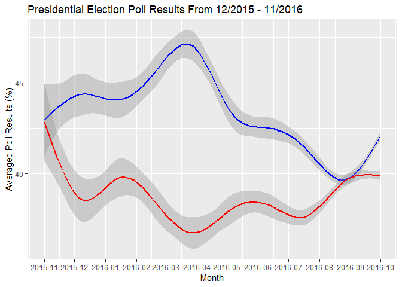 (Saving the plot as pdf/png)

``` r
pdf(paste(MyPath,"/Clinton_Trump_Polls_Raw.pdf", sep=""), width = 10, height = 7)
    par(mfrow=c(1,1))
    par(mar=c(5,5,5,5))
    ggplot(data = poll, aes(month)) + 
      geom_smooth(aes(y = rawpoll_clinton, color="Clinton"), color="blue") +
      geom_smooth(aes(y = rawpoll_trump, color="Trump"), color="red") +
      scale_x_date(labels = date_format("%Y-%m"),
                   date_breaks = "1 month")  + 
      labs(x = "Month", y = "Averaged Poll Results (%)", 
           title = "Presidential Election Poll Results From 12/2015 - 11/2016")
```

    ## `geom_smooth()` using method = 'gam' and formula 'y ~ s(x, bs = "cs")'
    ## `geom_smooth()` using method = 'gam' and formula 'y ~ s(x, bs = "cs")'

``` r
png(paste(MyPath,"/Clinton_Trump_Polls_Raw.png", sep=""), width = 800, height = 500)
    par(mfrow=c(1,1))
    par(mar=c(5,5,5,5))
    ggplot(data = poll, aes(month)) + 
      geom_smooth(aes(y = rawpoll_clinton, color="Clinton"), color="blue") +
      geom_smooth(aes(y = rawpoll_trump, color="Trump"), color="red") +
      scale_x_date(labels = date_format("%Y-%m"),
                   date_breaks = "1 month")  + 
      labs(x = "Month", y = "Averaged Poll Results (%)", 
           title = "Presidential Election Poll Results From 12/2015 - 11/2016")
```

    ## `geom_smooth()` using method = 'gam' and formula 'y ~ s(x, bs = "cs")'
    ## `geom_smooth()` using method = 'gam' and formula 'y ~ s(x, bs = "cs")'

Plot of Polls Adjusted data
===========================

``` r
ggplot(data = poll, aes(month)) + 
  geom_smooth(aes(y = adjpoll_clinton, color = "Clinton"), show.legend = TRUE, color="blue") +
  geom_smooth(aes(y = adjpoll_trump, color = "Trump"), show.legend = TRUE, color="red") +
  scale_x_date(labels = date_format("%Y-%m"),
               date_breaks = "1 month")  + 
  labs(x = "Month", y = "Averaged Poll Results (%)", 
       title = "Presidential Election Poll (Adj) Results From 12/2015 - 11/2016")
```

    ## `geom_smooth()` using method = 'gam' and formula 'y ~ s(x, bs = "cs")'
    ## `geom_smooth()` using method = 'gam' and formula 'y ~ s(x, bs = "cs")'

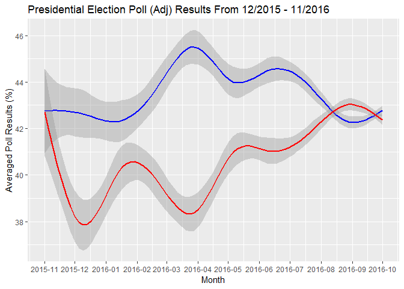

(Saving the plot as pdf/png)

``` r
pdf(paste(MyPath,"/Clinton_Trump_Polls_Adj.pdf", sep=""), width = 10, height = 7)
    par(mfrow=c(1,1))
    par(mar=c(5,5,5,5))
    ggplot(data = poll, aes(month)) + 
      geom_smooth(aes(y = adjpoll_clinton, color = "Clinton"), show.legend = TRUE, color="blue") +
      geom_smooth(aes(y = adjpoll_trump, color = "Trump"), show.legend = TRUE, color="red") +
      scale_x_date(labels = date_format("%Y-%m"),
                   date_breaks = "1 month")  + 
      labs(x = "Month", y = "Averaged Poll Results (%)", 
           title = "Presidential Election Poll (Adj) Results From 12/2015 - 11/2016")
```

    ## `geom_smooth()` using method = 'gam' and formula 'y ~ s(x, bs = "cs")'
    ## `geom_smooth()` using method = 'gam' and formula 'y ~ s(x, bs = "cs")'

``` r
png(paste(MyPath,"/Clinton_Trump_Polls_Adj.png", sep=""), width = 800, height = 500)
    par(mfrow=c(1,1))
    par(mar=c(5,5,5,5))
    ggplot(data = poll, aes(month)) + 
      geom_smooth(aes(y = adjpoll_clinton, color = "Clinton"), show.legend = TRUE, color="blue") +
      geom_smooth(aes(y = adjpoll_trump, color = "Trump"), show.legend = TRUE, color="red") +
      scale_x_date(labels = date_format("%Y-%m"),
                   date_breaks = "1 month")  + 
      labs(x = "Month", y = "Averaged Poll Results (%)", 
           title = "Presidential Election Poll (Adj) Results From 12/2015 - 11/2016")
```

    ## `geom_smooth()` using method = 'gam' and formula 'y ~ s(x, bs = "cs")'
    ## `geom_smooth()` using method = 'gam' and formula 'y ~ s(x, bs = "cs")'

Plot of Polls Adjusted and Raw data
===================================

``` r
ggplot(data = poll, aes(month)) + 
  geom_smooth(aes(y = adjpoll_clinton, color = "Clinton"), show.legend = TRUE, color="blue") +
  geom_smooth(aes(y = adjpoll_trump, color = "Trump"), show.legend = TRUE, color="red") +
  geom_smooth(aes(y = rawpoll_clinton, color = "Clinton"), show.legend = TRUE, color="darkblue") +
  geom_smooth(aes(y = rawpoll_trump, color = "Trump"), show.legend = TRUE, color="darkred") +
  scale_x_date(labels = date_format("%Y-%m"),
               date_breaks = "1 month")  + 
  labs(x = "Month", y = "Averaged Poll Results (%)", 
       title = "Presidential Election Poll Results From 12/2015 - 11/2016 (Raw - darker - and Adjusted) ")
```

    ## `geom_smooth()` using method = 'gam' and formula 'y ~ s(x, bs = "cs")'
    ## `geom_smooth()` using method = 'gam' and formula 'y ~ s(x, bs = "cs")'
    ## `geom_smooth()` using method = 'gam' and formula 'y ~ s(x, bs = "cs")'
    ## `geom_smooth()` using method = 'gam' and formula 'y ~ s(x, bs = "cs")'

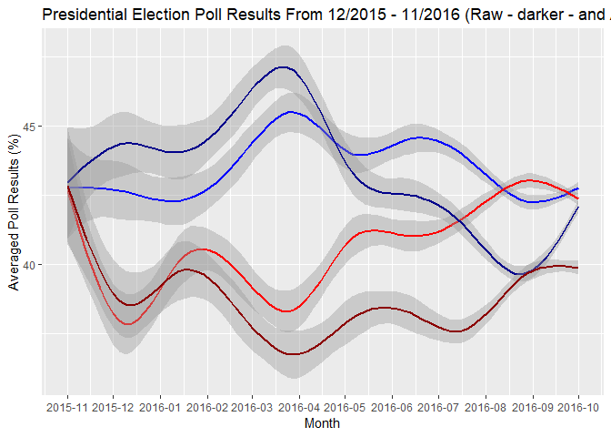 (Saving the plot as pdf/png)

``` r
pdf(paste(MyPath,"/Clinton_Trump_Polls_2.pdf", sep=""), width = 10, height = 7)
    par(mfrow=c(1,1))
    par(mar=c(5,5,5,5))
    ggplot(data = poll, aes(month)) + 
      geom_smooth(aes(y = adjpoll_clinton, color = "Clinton"), show.legend = TRUE, color="blue") +
      geom_smooth(aes(y = adjpoll_trump, color = "Trump"), show.legend = TRUE, color="red") +
      geom_smooth(aes(y = rawpoll_clinton, color = "Clinton"), show.legend = TRUE, color="darkblue") +
      geom_smooth(aes(y = rawpoll_trump, color = "Trump"), show.legend = TRUE, color="darkred") +
      scale_x_date(labels = date_format("%Y-%m"),
                   date_breaks = "1 month")  + 
      labs(x = "Month", y = "Averaged Poll Results (%)", 
           title = "Presidential Election Poll Results From 12/2015 - 11/2016 (Raw (darker) and Adjusted ")
```

    ## `geom_smooth()` using method = 'gam' and formula 'y ~ s(x, bs = "cs")'
    ## `geom_smooth()` using method = 'gam' and formula 'y ~ s(x, bs = "cs")'
    ## `geom_smooth()` using method = 'gam' and formula 'y ~ s(x, bs = "cs")'
    ## `geom_smooth()` using method = 'gam' and formula 'y ~ s(x, bs = "cs")'

``` r
png(paste(MyPath,"/Clinton_Trump_Polls_2.png", sep=""), width = 800, height = 500)
    par(mfrow=c(1,1))
    par(mar=c(5,5,5,5))
    ggplot(data = poll, aes(month)) + 
      geom_smooth(aes(y = adjpoll_clinton, color = "Clinton"), show.legend = TRUE, color="blue") +
      geom_smooth(aes(y = adjpoll_trump, color = "Trump"), show.legend = TRUE, color="red") +
      geom_smooth(aes(y = rawpoll_clinton, color = "Clinton"), show.legend = TRUE, color="darkblue") +
      geom_smooth(aes(y = rawpoll_trump, color = "Trump"), show.legend = TRUE, color="darkred") +
      scale_x_date(labels = date_format("%Y-%m"),
                   date_breaks = "1 month")  + 
      labs(x = "Month", y = "Averaged Poll Results (%)", 
           title = "Presidential Election Poll Results From 12/2015 - 11/2016 (Raw (darker) and Adjusted ")  
```

    ## `geom_smooth()` using method = 'gam' and formula 'y ~ s(x, bs = "cs")'
    ## `geom_smooth()` using method = 'gam' and formula 'y ~ s(x, bs = "cs")'
    ## `geom_smooth()` using method = 'gam' and formula 'y ~ s(x, bs = "cs")'
    ## `geom_smooth()` using method = 'gam' and formula 'y ~ s(x, bs = "cs")'

Poll Results by Grade
---------------------

``` r
ggplot(poll,aes(month,group=month,alpha=.3))+
  geom_boxplot(aes(y = adjpoll_clinton), color="blue")+
  geom_boxplot(aes(y = adjpoll_trump), color="red") + 
  scale_x_date(labels = date_format("%Y-%m"),
               date_breaks = "1 month")+
  facet_wrap(~grade)+labs(x = "Month", y = "Averaged Poll Results (%)", 
                          title = "Presidential Election Poll Results From 12/2015 - 11/2016")
```

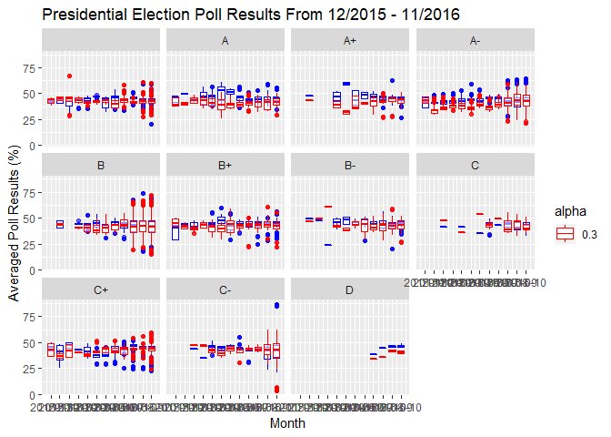 (Saving the plot as pdf/png)

``` r
pdf(paste(MyPath,"/Clinton_Trump_Polls_boxplots.pdf", sep=""), width = 20, height = 15)
    par(mfrow=c(1,1))
    par(mar=c(5,5,5,5))
    ggplot(poll,aes(month,group=month,alpha=.3))+
      geom_boxplot(aes(y = adjpoll_clinton), color="blue")+
      geom_boxplot(aes(y = adjpoll_trump), color="red") + 
      scale_x_date(labels = date_format("%Y-%m"),
                   date_breaks = "1 month")+
      facet_wrap(~grade)+labs(x = "Month", y = "Averaged Poll Results (%)", 
                              title = "Presidential Election Poll Results From 12/2015 - 11/2016")

png(paste(MyPath,"/Clinton_Trump_Polls_boxplots.png", sep=""), width = 1100, height = 700)
    par(mfrow=c(1,1))
    par(mar=c(5,5,5,5))
    ggplot(poll,aes(month,group=month,alpha=.3))+
      geom_boxplot(aes(y = adjpoll_clinton), color="blue")+
      geom_boxplot(aes(y = adjpoll_trump), color="red") + 
      scale_x_date(labels = date_format("%Y-%m"),
                   date_breaks = "1 month")+
      facet_wrap(~grade)+labs(x = "Month", y = "Averaged Poll Results (%)", 
                              title = "Presidential Election Poll Results From 12/2015 - 11/2016")  
```

Time Series Models
==================

Now, in this section I plan to run some ARIMA models. I want to see if AutoRegressive models and Moving Averages could be used to explain the variation in in the polls.

Data Wrangling
--------------

First I need to transform my data to time series.

``` r
xts_poll<-xts(poll, poll$enddate)
Clinton_Polls<-xts(poll$rawpoll_clinton, poll$enddate)
Trump_Polls<-xts(poll$rawpoll_trump, poll$enddate)
Clinton_Trump_Polls<-merge(Clinton_Polls,Trump_Polls)
```

Plotting the polls by day without any smoothing.

``` r
autoplot(Clinton_Trump_Polls)  +
  ggtitle("Clinton/Trump Polls - Presidential Election Poll Results From 12/2015 - 11/2016") +
  xlab("Time") +
  ylab("Percentage")
```

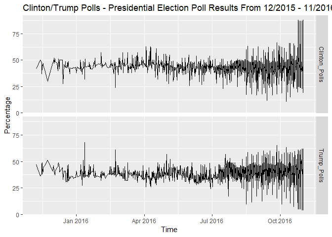 (Saving the plot as pdf/png)

``` r
pdf(paste(MyPath,"/Clinton_Trump_Polls_TS.pdf", sep=""), width = 10, height = 7)
    par(mfrow=c(1,1))
    par(mar=c(5,5,5,5))
    autoplot(Clinton_Trump_Polls)  +
    ggtitle("Clinton/Trump Polls - Presidential Election Poll Results From 12/2015 - 11/2016") +
      xlab("Time") +
      ylab("Percentage")

png(paste(MyPath,"/Clinton_Trump_Polls_TS.png", sep=""), width = 800, height = 500)
    par(mfrow=c(1,1))
    par(mar=c(5,5,5,5))
    autoplot(Clinton_Trump_Polls)  +
    ggtitle("Clinton/Trump Polls - Presidential Election Poll Results From 12/2015 - 11/2016") +
      xlab("Time") +
      ylab("Percentage")   
```

Clinton Time Series Model (ARIMA)
---------------------------------

Here I try to fit an ARIMA in the time series data of Clinton's pools. In order to do that I use "auto.arima", which will calculate several models to verify the best fit. The algorithm will do:

``` r
fit_clinton <- auto.arima(as.vector(Clinton_Trump_Polls[,"Clinton_Polls"]))
fit_clinton
```

    ## Series: as.vector(Clinton_Trump_Polls[, "Clinton_Polls"]) 
    ## ARIMA(1,1,2) 
    ## 
    ## Coefficients:
    ##          ar1      ma1    ma2
    ##       0.9090  -1.8007  0.804
    ## s.e.  0.0136   0.0155  0.015
    ## 
    ## sigma^2 estimated as 47.37:  log likelihood=-34266.18
    ## AIC=68540.37   AICc=68540.37   BIC=68569.3

Therefore, the best fit is an ARIMA(1,1,2). The algorithm calculate the first difference since the time series was not stationary.

### Forecasting

``` r
fit_clinton <- auto.arima(as.vector(Clinton_Trump_Polls[,"Clinton_Polls"]))
fit_clinton %>% forecast(h=10) %>% autoplot(include=80)
```

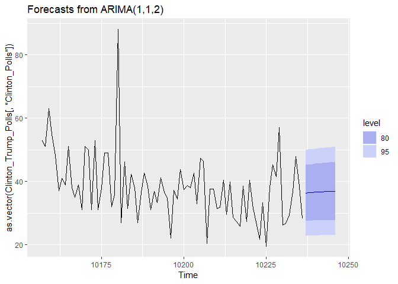 The forecast is good, but not that useful. For a significance level of 5%, the forecast ranges from low 50%'s to 30%'s.

(Saving the plot as pdf/png)

``` r
pdf(paste(MyPath,"/Clinton_forecast.pdf", sep=""), width = 10, height = 7)
    par(mfrow=c(1,1))
    par(mar=c(5,5,5,5))
    fit_clinton %>% forecast(h=10) %>% autoplot(include=80)

png(paste(MyPath,"/Clinton_forecast.png", sep=""), width = 800, height = 500)
    par(mfrow=c(1,1))
    par(mar=c(5,5,5,5))
    fit_clinton %>% forecast(h=10) %>% autoplot(include=80)   
```

### Checking Residuals

``` r
# autoplot(fit_clinton) # To check if the roots are inside the unit circle
checkresiduals(fit_clinton)
```

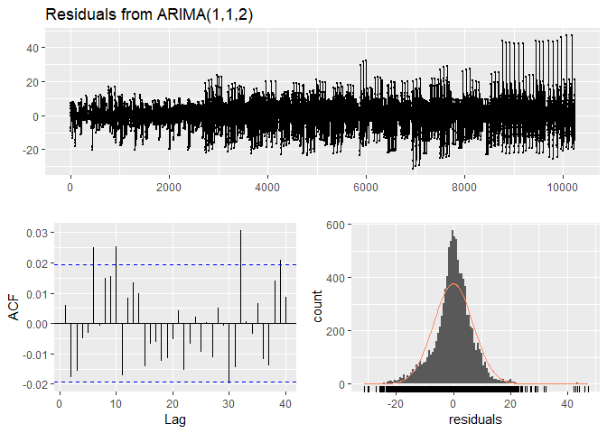

    ## 
    ##  Ljung-Box test
    ## 
    ## data:  Residuals from ARIMA(1,1,2)
    ## Q* = 24.248, df = 7, p-value = 0.00103
    ## 
    ## Model df: 3.   Total lags used: 10

Checking the results we see that the model is good to explain past performance. The residuals are almost normally distributed. The ACF does not show any significant lag up to 5 lags.

(Saving the plot as pdf/png)

``` r
pdf(paste(MyPath,"/Clinton_forecast_residuals.pdf", sep=""), width = 10, height = 8)
    par(mfrow=c(1,1))
    par(mar=c(5,5,5,5))
    checkresiduals(fit_clinton)
```

    ## 
    ##  Ljung-Box test
    ## 
    ## data:  Residuals from ARIMA(1,1,2)
    ## Q* = 24.248, df = 7, p-value = 0.00103
    ## 
    ## Model df: 3.   Total lags used: 10

``` r
png(paste(MyPath,"/Clinton_forecast_residuals.png", sep=""), width = 800, height = 600)
    par(mfrow=c(1,1))
    par(mar=c(5,5,5,5))
    checkresiduals(fit_clinton)    
```

    ## 
    ##  Ljung-Box test
    ## 
    ## data:  Residuals from ARIMA(1,1,2)
    ## Q* = 24.248, df = 7, p-value = 0.00103
    ## 
    ## Model df: 3.   Total lags used: 10

Trump Time Series Model (ARIMA)
-------------------------------

Now I try to fit an ARIMA in the time series data of Trump's pools. In order to do that I use "auto.arima", which will calculate several models to verify the best fit. The algorithm will do:

``` r
fit_trump <- auto.arima(as.vector(Clinton_Trump_Polls[,"Trump_Polls"]))
fit_trump
```

    ## Series: as.vector(Clinton_Trump_Polls[, "Trump_Polls"]) 
    ## ARIMA(1,1,1) 
    ## 
    ## Coefficients:
    ##          ar1      ma1
    ##       0.0240  -0.9493
    ## s.e.  0.0107   0.0041
    ## 
    ## sigma^2 estimated as 51.74:  log likelihood=-34717.61
    ## AIC=69441.21   AICc=69441.21   BIC=69462.91

Therefore, the best fit is an ARIMA(1,1,1). The algorithm calculate the first difference since the time series was not stationary.

### Forecasting

``` r
fit_trump %>% forecast(h=10) %>% autoplot(include=80)
```

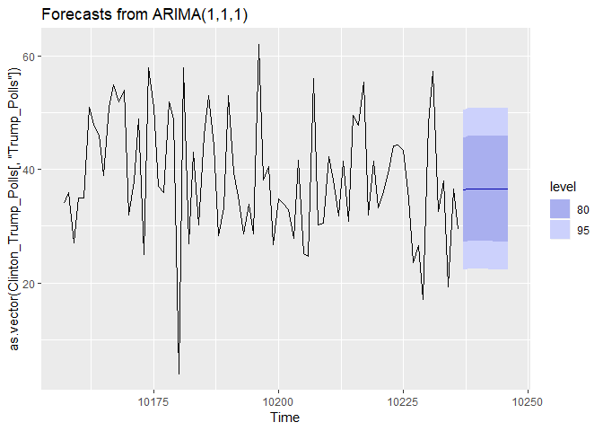

The forecast is good, but not that useful. For a significance level of 5%, the forecast ranges from low 50%'s to 30%'s (similar to Clinton).

(Saving the plot as pdf/png)

``` r
pdf(paste(MyPath,"/Trump_forecast.pdf", sep=""), width = 10, height = 7)
    par(mfrow=c(1,1))
    par(mar=c(5,5,5,5))
    fit_trump %>% forecast(h=10) %>% autoplot(include=80)

png(paste(MyPath,"/Trump_forecast.png", sep=""), width = 800, height = 500)
    par(mfrow=c(1,1))
    par(mar=c(5,5,5,5))
    fit_trump %>% forecast(h=10) %>% autoplot(include=80)   
```

### Checking Residuals

``` r
# autoplot(fit_trump) # To check if the roots are inside the unit circle
checkresiduals(fit_trump)
```


    ## 
    ##  Ljung-Box test
    ## 
    ## data:  Residuals from ARIMA(1,1,1)
    ## Q* = 62.387, df = 8, p-value = 1.582e-10
    ## 
    ## Model df: 2.   Total lags used: 10

Again, when we checking the results we see that the model is good to explain past performance. The residuals are almost normally distributed. The ACF does not show any significant lag up to 5 lags.

(Saving the plot as pdf/png)

``` r
pdf(paste(MyPath,"/Trump_forecast_residuals.pdf", sep=""), width = 10, height = 8)
    par(mfrow=c(1,1))
    par(mar=c(5,5,5,5))
    checkresiduals(fit_trump)
```

    ## 
    ##  Ljung-Box test
    ## 
    ## data:  Residuals from ARIMA(1,1,1)
    ## Q* = 62.387, df = 8, p-value = 1.582e-10
    ## 
    ## Model df: 2.   Total lags used: 10

``` r
png(paste(MyPath,"/Trump_forecast_residuals.png", sep=""), width = 800, height = 600)
    par(mfrow=c(1,1))
    par(mar=c(5,5,5,5))
    checkresiduals(fit_trump)  
```

    ## 
    ##  Ljung-Box test
    ## 
    ## data:  Residuals from ARIMA(1,1,1)
    ## Q* = 62.387, df = 8, p-value = 1.582e-10
    ## 
    ## Model df: 2.   Total lags used: 10

Markov Models
=============

In this section I run Markov models. The idea is to see how Markov Chains perform predicting the outcome of presidential election per state. In order to do that, we need to load a different dataset. Below I load the results per state (for all 50 states + D.C.) of the election starting on 1900.

Loading Data & Data Wrangling
-----------------------------

``` r
us_presid_results_1828_2016 <- fread("C:\\Users\\Caio Laptop\\OneDrive - The University of Kansas\\Documents\\PhD\\11. Courses\\19. EECS 731 - Introduction to Data Science\\Final Project\\US Presidential Results & PVIs by State 1828-2016_edited.csv",
                                      stringsAsFactors = T)
us_presid_results_1828_2016<-us_presid_results_1828_2016[,-(4:6)]
# us_presid_results_1828_2016<-us_presid_results_1828_2016[!(us_presid_results_1828_2016$State=="Nationwide")]

us_presid_results_1828_2016_by_state <- us_presid_results_1828_2016 %>% group_by(State)
us_presid_results_1828_2016_by_state2 <- split(us_presid_results_1828_2016, us_presid_results_1828_2016$State)
```

Creating variables to store elections years, states names, and verifying my first year of elections

``` r
myStates<-names(us_presid_results_1828_2016_by_state2)
myYears<-unique(us_presid_results_1828_2016$Year)

myStates
```

    ##  [1] "Alabama"        "Alaska"         "Arizona"        "Arkansas"      
    ##  [5] "California"     "Colorado"       "Connecticut"    "Delaware"      
    ##  [9] "Florida"        "Georgia"        "Hawaii"         "Idaho"         
    ## [13] "Illinois"       "Indiana"        "Iowa"           "Kansas"        
    ## [17] "Kentucky"       "Louisiana"      "Maine"          "Maryland"      
    ## [21] "Massachusetts"  "Michigan"       "Minnesota"      "Mississippi"   
    ## [25] "Missouri"       "Montana"        "Nationwide"     "Nebraska"      
    ## [29] "Nevada"         "New Hampshire"  "New Jersey"     "New Mexico"    
    ## [33] "New York"       "North Carolina" "North Dakota"   "Ohio"          
    ## [37] "Oklahoma"       "Oregon"         "Pennsylvania"   "Rhode Island"  
    ## [41] "South Carolina" "South Dakota"   "Tennessee"      "Texas"         
    ## [45] "Utah"           "Vermont"        "Virginia"       "Washington"    
    ## [49] "Washington DC"  "West Virginia"  "Wisconsin"      "Wyoming"

``` r
myYears
```

    ##  [1] 2016 2012 2008 2004 2000 1996 1992 1988 1984 1980 1976 1972 1968 1964
    ## [15] 1960 1956 1952 1948 1944 1940 1936 1932 1928 1924 1920 1916 1912 1908
    ## [29] 1904 1900

Creating a different data.frame for each state with presidential elections results

``` r
for (i in 1:length(us_presid_results_1828_2016_by_state2)){
  my_state<-as.data.frame(us_presid_results_1828_2016_by_state2[i] , stringsAsFactors = T)[,-3]
  colnames(my_state)<-c("Winner","Year")
  assign(names(us_presid_results_1828_2016_by_state2[i]), my_state)
}
rm(i, my_state)
```

Markov Chain
------------

Below I run the Markov Chain models. In order to do that I needed to create new data.frames (Errors\_matrix, Predictions\_2020, and errors\_states). So, in this loop, we need to start forecating from the 3rd election in our sample, i.e., election of 1912. The reason is because, to start the chain with reasonably data, we need to 2 election (1900 and 1904) to estimate a transiction matrix. Then, using the result from 1908 election we can predict the outcome for 1912 presidential election per U.S. state. I decided to print the prediction per state per election year (sorry, the output is long - but it helps me to verify the results). Now, to not create to many graphs, for 2020 presidential election I made my loop create a pdf file in which it plots for each state the transiction matrix using diagrams. Finally, I also created a prediction matrix per state for the 2020 election.

``` r
library(markovchain)
```

    ## Package:  markovchain
    ## Version:  0.6.9.12
    ## Date:     2018-08-23
    ## BugReport: http://github.com/spedygiorgio/markovchain/issues

    ## 
    ## Attaching package: 'markovchain'

    ## The following object is masked from 'package:acs':
    ## 
    ##     name

``` r
Errors_matrix<-matrix(NA, nrow = (length(myYears)-2), ncol= 2)
Predictions_2020<-NULL
errors_states<-NULL

for (j in 2:(length(myYears)-1)){
  
  if(j==(length(myYears)-1)){
    pdf(paste(MyPath,"/Markov",min(myYears)+4*(j+1),".pdf", sep=""), width=15, height=40)
    par(mfrow=c(13,4))
    par(mar=c(5,5,5,5))
  }  
  
  error=0
  for(i in 1:length(us_presid_results_1828_2016_by_state2)){
    mysequence<-subset(get(myStates[i]), Year<=min(myYears)+4*(j-1))[,1]
    cons_matrix<-createSequenceMatrix(mysequence, possibleStates = c("dem", "rep"))
    myFit<-markovchainFit(data=mysequence,confidencelevel = .9, possibleStates = c("dem", "rep"))
    Realized<-as.character(subset(get(myStates[i]), Year==min(myYears)+4*j)[1],stringsAsFactors =F)
    if(Realized==1){Realized=c("dem")}
    if(Realized==2){Realized=c("rep")}
    myPrediction<-predict(myFit$estimate, newdata=Realized, n.ahead =1)
    print(paste("prediction for state: ", myStates[i], " | Year = ", min(myYears)+4*(j+1), " is ", myPrediction, sep="")) 
    
    if(j==(length(myYears)-1)){
      Predictions<-c(myStates[i], myPrediction)
      Predictions_2020<-rbind(Predictions_2020, Predictions)
    }else{
      Realized_t1<-subset(get(myStates[i]), Year==(min(myYears)+4*(j+1)))[1]
      if(Realized_t1==1){Realized_t1=c("dem")}
      if(Realized_t1==2){Realized_t1=c("rep")}
      
      if(myPrediction==Realized_t1){
        error=error
      }else{ 
        error=error+1 
        errors_states<-rbind(errors_states, myStates[i])
        }
    }
    
    if(j==(length(myYears)-1)){  
      test<-as.matrix(myFit$estimate@transitionMatrix)
      dtmcA <- new("markovchain",transitionMatrix=test, states=c("dem","rep"), name="MarkovChain A")
      plot(dtmcA, cex=1, label.cex=5, label.font= 2, size=4, size2=4, arrow.size=1, #cex.axis=1.5, cex.main=1.5, cex.sub=1.5,
           main=paste("Markov chain plot - Transition Matrix - ", myStates[i], sep=""),
           edge.arrow.size=1)
    }  
  }
  
  if (j<(length(myYears)-1)){
  Errors_matrix[j,1] <- (min(myYears)+4*(j+1))
  Errors_matrix[j,2] <- error
  }else{dev.off()}
}
```

    ## [1] "prediction for state: Alabama | Year = 1912 is dem"
    ## [1] "prediction for state: Alaska | Year = 1912 is rep"
    ## [1] "prediction for state: Arizona | Year = 1912 is rep"
    ## [1] "prediction for state: Arkansas | Year = 1912 is dem"
    ## [1] "prediction for state: California | Year = 1912 is rep"
    ## [1] "prediction for state: Colorado | Year = 1912 is rep"
    ## [1] "prediction for state: Connecticut | Year = 1912 is rep"
    ## [1] "prediction for state: Delaware | Year = 1912 is rep"
    ## [1] "prediction for state: Florida | Year = 1912 is dem"
    ## [1] "prediction for state: Georgia | Year = 1912 is dem"
    ## [1] "prediction for state: Hawaii | Year = 1912 is rep"
    ## [1] "prediction for state: Idaho | Year = 1912 is dem"
    ## [1] "prediction for state: Illinois | Year = 1912 is rep"
    ## [1] "prediction for state: Indiana | Year = 1912 is rep"
    ## [1] "prediction for state: Iowa | Year = 1912 is rep"
    ## [1] "prediction for state: Kansas | Year = 1912 is rep"
    ## [1] "prediction for state: Kentucky | Year = 1912 is dem"
    ## [1] "prediction for state: Louisiana | Year = 1912 is dem"
    ## [1] "prediction for state: Maine | Year = 1912 is rep"
    ## [1] "prediction for state: Maryland | Year = 1912 is rep"
    ## [1] "prediction for state: Massachusetts | Year = 1912 is rep"
    ## [1] "prediction for state: Michigan | Year = 1912 is rep"
    ## [1] "prediction for state: Minnesota | Year = 1912 is rep"
    ## [1] "prediction for state: Mississippi | Year = 1912 is dem"
    ## [1] "prediction for state: Missouri | Year = 1912 is dem"
    ## [1] "prediction for state: Montana | Year = 1912 is dem"
    ## [1] "prediction for state: Nationwide | Year = 1912 is rep"
    ## [1] "prediction for state: Nebraska | Year = 1912 is dem"
    ## [1] "prediction for state: Nevada | Year = 1912 is rep"
    ## [1] "prediction for state: New Hampshire | Year = 1912 is rep"
    ## [1] "prediction for state: New Jersey | Year = 1912 is rep"
    ## [1] "prediction for state: New Mexico | Year = 1912 is rep"
    ## [1] "prediction for state: New York | Year = 1912 is rep"
    ## [1] "prediction for state: North Carolina | Year = 1912 is dem"
    ## [1] "prediction for state: North Dakota | Year = 1912 is rep"
    ## [1] "prediction for state: Ohio | Year = 1912 is rep"
    ## [1] "prediction for state: Oklahoma | Year = 1912 is rep"
    ## [1] "prediction for state: Oregon | Year = 1912 is rep"
    ## [1] "prediction for state: Pennsylvania | Year = 1912 is rep"
    ## [1] "prediction for state: Rhode Island | Year = 1912 is rep"
    ## [1] "prediction for state: South Carolina | Year = 1912 is dem"
    ## [1] "prediction for state: South Dakota | Year = 1912 is rep"
    ## [1] "prediction for state: Tennessee | Year = 1912 is dem"
    ## [1] "prediction for state: Texas | Year = 1912 is dem"
    ## [1] "prediction for state: Utah | Year = 1912 is rep"
    ## [1] "prediction for state: Vermont | Year = 1912 is rep"
    ## [1] "prediction for state: Virginia | Year = 1912 is dem"
    ## [1] "prediction for state: Washington | Year = 1912 is rep"
    ## [1] "prediction for state: Washington DC | Year = 1912 is rep"
    ## [1] "prediction for state: West Virginia | Year = 1912 is rep"
    ## [1] "prediction for state: Wisconsin | Year = 1912 is rep"
    ## [1] "prediction for state: Wyoming | Year = 1912 is rep"
    ## [1] "prediction for state: Alabama | Year = 1916 is dem"
    ## [1] "prediction for state: Alaska | Year = 1916 is rep"
    ## [1] "prediction for state: Arizona | Year = 1916 is dem"
    ## [1] "prediction for state: Arkansas | Year = 1916 is dem"
    ## [1] "prediction for state: California | Year = 1916 is dem"
    ## [1] "prediction for state: Colorado | Year = 1916 is rep"
    ## [1] "prediction for state: Connecticut | Year = 1916 is rep"
    ## [1] "prediction for state: Delaware | Year = 1916 is dem"
    ## [1] "prediction for state: Florida | Year = 1916 is dem"
    ## [1] "prediction for state: Georgia | Year = 1916 is dem"
    ## [1] "prediction for state: Hawaii | Year = 1916 is rep"
    ## [1] "prediction for state: Idaho | Year = 1916 is dem"
    ## [1] "prediction for state: Illinois | Year = 1916 is rep"
    ## [1] "prediction for state: Indiana | Year = 1916 is rep"
    ## [1] "prediction for state: Iowa | Year = 1916 is rep"
    ## [1] "prediction for state: Kansas | Year = 1916 is rep"
    ## [1] "prediction for state: Kentucky | Year = 1916 is dem"
    ## [1] "prediction for state: Louisiana | Year = 1916 is dem"
    ## [1] "prediction for state: Maine | Year = 1916 is rep"
    ## [1] "prediction for state: Maryland | Year = 1916 is dem"
    ## [1] "prediction for state: Massachusetts | Year = 1916 is dem"
    ## [1] "prediction for state: Michigan | Year = 1916 is rep"
    ## [1] "prediction for state: Minnesota | Year = 1916 is dem"
    ## [1] "prediction for state: Mississippi | Year = 1916 is dem"
    ## [1] "prediction for state: Missouri | Year = 1916 is rep"
    ## [1] "prediction for state: Montana | Year = 1916 is dem"
    ## [1] "prediction for state: Nationwide | Year = 1916 is dem"
    ## [1] "prediction for state: Nebraska | Year = 1916 is rep"
    ## [1] "prediction for state: Nevada | Year = 1916 is rep"
    ## [1] "prediction for state: New Hampshire | Year = 1916 is rep"
    ## [1] "prediction for state: New Jersey | Year = 1916 is rep"
    ## [1] "prediction for state: New Mexico | Year = 1916 is rep"
    ## [1] "prediction for state: New York | Year = 1916 is dem"
    ## [1] "prediction for state: North Carolina | Year = 1916 is dem"
    ## [1] "prediction for state: North Dakota | Year = 1916 is dem"
    ## [1] "prediction for state: Ohio | Year = 1916 is dem"
    ## [1] "prediction for state: Oklahoma | Year = 1916 is rep"
    ## [1] "prediction for state: Oregon | Year = 1916 is rep"
    ## [1] "prediction for state: Pennsylvania | Year = 1916 is dem"
    ## [1] "prediction for state: Rhode Island | Year = 1916 is rep"
    ## [1] "prediction for state: South Carolina | Year = 1916 is dem"
    ## [1] "prediction for state: South Dakota | Year = 1916 is dem"
    ## [1] "prediction for state: Tennessee | Year = 1916 is dem"
    ## [1] "prediction for state: Texas | Year = 1916 is dem"
    ## [1] "prediction for state: Utah | Year = 1916 is rep"
    ## [1] "prediction for state: Vermont | Year = 1916 is rep"
    ## [1] "prediction for state: Virginia | Year = 1916 is dem"
    ## [1] "prediction for state: Washington | Year = 1916 is dem"
    ## [1] "prediction for state: Washington DC | Year = 1916 is rep"
    ## [1] "prediction for state: West Virginia | Year = 1916 is dem"
    ## [1] "prediction for state: Wisconsin | Year = 1916 is dem"
    ## [1] "prediction for state: Wyoming | Year = 1916 is rep"
    ## [1] "prediction for state: Alabama | Year = 1920 is dem"
    ## [1] "prediction for state: Alaska | Year = 1920 is rep"
    ## [1] "prediction for state: Arizona | Year = 1920 is rep"
    ## [1] "prediction for state: Arkansas | Year = 1920 is dem"
    ## [1] "prediction for state: California | Year = 1920 is rep"
    ## [1] "prediction for state: Colorado | Year = 1920 is rep"
    ## [1] "prediction for state: Connecticut | Year = 1920 is rep"
    ## [1] "prediction for state: Delaware | Year = 1920 is rep"
    ## [1] "prediction for state: Florida | Year = 1920 is dem"
    ## [1] "prediction for state: Georgia | Year = 1920 is dem"
    ## [1] "prediction for state: Hawaii | Year = 1920 is rep"
    ## [1] "prediction for state: Idaho | Year = 1920 is rep"
    ## [1] "prediction for state: Illinois | Year = 1920 is rep"
    ## [1] "prediction for state: Indiana | Year = 1920 is rep"
    ## [1] "prediction for state: Iowa | Year = 1920 is rep"
    ## [1] "prediction for state: Kansas | Year = 1920 is rep"
    ## [1] "prediction for state: Kentucky | Year = 1920 is dem"
    ## [1] "prediction for state: Louisiana | Year = 1920 is dem"
    ## [1] "prediction for state: Maine | Year = 1920 is rep"
    ## [1] "prediction for state: Maryland | Year = 1920 is rep"
    ## [1] "prediction for state: Massachusetts | Year = 1920 is rep"
    ## [1] "prediction for state: Michigan | Year = 1920 is rep"
    ## [1] "prediction for state: Minnesota | Year = 1920 is rep"
    ## [1] "prediction for state: Mississippi | Year = 1920 is dem"
    ## [1] "prediction for state: Missouri | Year = 1920 is rep"
    ## [1] "prediction for state: Montana | Year = 1920 is rep"
    ## [1] "prediction for state: Nationwide | Year = 1920 is rep"
    ## [1] "prediction for state: Nebraska | Year = 1920 is dem"
    ## [1] "prediction for state: Nevada | Year = 1920 is dem"
    ## [1] "prediction for state: New Hampshire | Year = 1920 is rep"
    ## [1] "prediction for state: New Jersey | Year = 1920 is rep"
    ## [1] "prediction for state: New Mexico | Year = 1920 is rep"
    ## [1] "prediction for state: New York | Year = 1920 is rep"
    ## [1] "prediction for state: North Carolina | Year = 1920 is dem"
    ## [1] "prediction for state: North Dakota | Year = 1920 is rep"
    ## [1] "prediction for state: Ohio | Year = 1920 is rep"
    ## [1] "prediction for state: Oklahoma | Year = 1920 is dem"
    ## [1] "prediction for state: Oregon | Year = 1920 is rep"
    ## [1] "prediction for state: Pennsylvania | Year = 1920 is rep"
    ## [1] "prediction for state: Rhode Island | Year = 1920 is rep"
    ## [1] "prediction for state: South Carolina | Year = 1920 is dem"
    ## [1] "prediction for state: South Dakota | Year = 1920 is rep"
    ## [1] "prediction for state: Tennessee | Year = 1920 is dem"
    ## [1] "prediction for state: Texas | Year = 1920 is dem"
    ## [1] "prediction for state: Utah | Year = 1920 is rep"
    ## [1] "prediction for state: Vermont | Year = 1920 is rep"
    ## [1] "prediction for state: Virginia | Year = 1920 is dem"
    ## [1] "prediction for state: Washington | Year = 1920 is rep"
    ## [1] "prediction for state: Washington DC | Year = 1920 is rep"
    ## [1] "prediction for state: West Virginia | Year = 1920 is rep"
    ## [1] "prediction for state: Wisconsin | Year = 1920 is rep"
    ## [1] "prediction for state: Wyoming | Year = 1920 is rep"
    ## [1] "prediction for state: Alabama | Year = 1924 is dem"
    ## [1] "prediction for state: Alaska | Year = 1924 is rep"
    ## [1] "prediction for state: Arizona | Year = 1924 is rep"
    ## [1] "prediction for state: Arkansas | Year = 1924 is dem"
    ## [1] "prediction for state: California | Year = 1924 is rep"
    ## [1] "prediction for state: Colorado | Year = 1924 is dem"
    ## [1] "prediction for state: Connecticut | Year = 1924 is rep"
    ## [1] "prediction for state: Delaware | Year = 1924 is rep"
    ## [1] "prediction for state: Florida | Year = 1924 is dem"
    ## [1] "prediction for state: Georgia | Year = 1924 is dem"
    ## [1] "prediction for state: Hawaii | Year = 1924 is rep"
    ## [1] "prediction for state: Idaho | Year = 1924 is dem"
    ## [1] "prediction for state: Illinois | Year = 1924 is rep"
    ## [1] "prediction for state: Indiana | Year = 1924 is rep"
    ## [1] "prediction for state: Iowa | Year = 1924 is rep"
    ## [1] "prediction for state: Kansas | Year = 1924 is rep"
    ## [1] "prediction for state: Kentucky | Year = 1924 is dem"
    ## [1] "prediction for state: Louisiana | Year = 1924 is dem"
    ## [1] "prediction for state: Maine | Year = 1924 is rep"
    ## [1] "prediction for state: Maryland | Year = 1924 is rep"
    ## [1] "prediction for state: Massachusetts | Year = 1924 is rep"
    ## [1] "prediction for state: Michigan | Year = 1924 is rep"
    ## [1] "prediction for state: Minnesota | Year = 1924 is rep"
    ## [1] "prediction for state: Mississippi | Year = 1924 is dem"
    ## [1] "prediction for state: Missouri | Year = 1924 is rep"
    ## [1] "prediction for state: Montana | Year = 1924 is dem"
    ## [1] "prediction for state: Nationwide | Year = 1924 is rep"
    ## [1] "prediction for state: Nebraska | Year = 1924 is rep"
    ## [1] "prediction for state: Nevada | Year = 1924 is dem"
    ## [1] "prediction for state: New Hampshire | Year = 1924 is rep"
    ## [1] "prediction for state: New Jersey | Year = 1924 is rep"
    ## [1] "prediction for state: New Mexico | Year = 1924 is rep"
    ## [1] "prediction for state: New York | Year = 1924 is rep"
    ## [1] "prediction for state: North Carolina | Year = 1924 is dem"
    ## [1] "prediction for state: North Dakota | Year = 1924 is rep"
    ## [1] "prediction for state: Ohio | Year = 1924 is rep"
    ## [1] "prediction for state: Oklahoma | Year = 1924 is rep"
    ## [1] "prediction for state: Oregon | Year = 1924 is rep"
    ## [1] "prediction for state: Pennsylvania | Year = 1924 is rep"
    ## [1] "prediction for state: Rhode Island | Year = 1924 is rep"
    ## [1] "prediction for state: South Carolina | Year = 1924 is dem"
    ## [1] "prediction for state: South Dakota | Year = 1924 is rep"
    ## [1] "prediction for state: Tennessee | Year = 1924 is dem"
    ## [1] "prediction for state: Texas | Year = 1924 is dem"
    ## [1] "prediction for state: Utah | Year = 1924 is rep"
    ## [1] "prediction for state: Vermont | Year = 1924 is rep"
    ## [1] "prediction for state: Virginia | Year = 1924 is dem"
    ## [1] "prediction for state: Washington | Year = 1924 is rep"
    ## [1] "prediction for state: Washington DC | Year = 1924 is rep"
    ## [1] "prediction for state: West Virginia | Year = 1924 is rep"
    ## [1] "prediction for state: Wisconsin | Year = 1924 is rep"
    ## [1] "prediction for state: Wyoming | Year = 1924 is rep"
    ## [1] "prediction for state: Alabama | Year = 1928 is dem"
    ## [1] "prediction for state: Alaska | Year = 1928 is rep"
    ## [1] "prediction for state: Arizona | Year = 1928 is rep"
    ## [1] "prediction for state: Arkansas | Year = 1928 is dem"
    ## [1] "prediction for state: California | Year = 1928 is rep"
    ## [1] "prediction for state: Colorado | Year = 1928 is dem"
    ## [1] "prediction for state: Connecticut | Year = 1928 is rep"
    ## [1] "prediction for state: Delaware | Year = 1928 is rep"
    ## [1] "prediction for state: Florida | Year = 1928 is dem"
    ## [1] "prediction for state: Georgia | Year = 1928 is dem"
    ## [1] "prediction for state: Hawaii | Year = 1928 is rep"
    ## [1] "prediction for state: Idaho | Year = 1928 is dem"
    ## [1] "prediction for state: Illinois | Year = 1928 is rep"
    ## [1] "prediction for state: Indiana | Year = 1928 is rep"
    ## [1] "prediction for state: Iowa | Year = 1928 is rep"
    ## [1] "prediction for state: Kansas | Year = 1928 is rep"
    ## [1] "prediction for state: Kentucky | Year = 1928 is dem"
    ## [1] "prediction for state: Louisiana | Year = 1928 is dem"
    ## [1] "prediction for state: Maine | Year = 1928 is rep"
    ## [1] "prediction for state: Maryland | Year = 1928 is rep"
    ## [1] "prediction for state: Massachusetts | Year = 1928 is rep"
    ## [1] "prediction for state: Michigan | Year = 1928 is rep"
    ## [1] "prediction for state: Minnesota | Year = 1928 is rep"
    ## [1] "prediction for state: Mississippi | Year = 1928 is dem"
    ## [1] "prediction for state: Missouri | Year = 1928 is dem"
    ## [1] "prediction for state: Montana | Year = 1928 is dem"
    ## [1] "prediction for state: Nationwide | Year = 1928 is rep"
    ## [1] "prediction for state: Nebraska | Year = 1928 is rep"
    ## [1] "prediction for state: Nevada | Year = 1928 is dem"
    ## [1] "prediction for state: New Hampshire | Year = 1928 is rep"
    ## [1] "prediction for state: New Jersey | Year = 1928 is rep"
    ## [1] "prediction for state: New Mexico | Year = 1928 is rep"
    ## [1] "prediction for state: New York | Year = 1928 is rep"
    ## [1] "prediction for state: North Carolina | Year = 1928 is dem"
    ## [1] "prediction for state: North Dakota | Year = 1928 is rep"
    ## [1] "prediction for state: Ohio | Year = 1928 is rep"
    ## [1] "prediction for state: Oklahoma | Year = 1928 is dem"
    ## [1] "prediction for state: Oregon | Year = 1928 is rep"
    ## [1] "prediction for state: Pennsylvania | Year = 1928 is rep"
    ## [1] "prediction for state: Rhode Island | Year = 1928 is rep"
    ## [1] "prediction for state: South Carolina | Year = 1928 is dem"
    ## [1] "prediction for state: South Dakota | Year = 1928 is rep"
    ## [1] "prediction for state: Tennessee | Year = 1928 is dem"
    ## [1] "prediction for state: Texas | Year = 1928 is dem"
    ## [1] "prediction for state: Utah | Year = 1928 is rep"
    ## [1] "prediction for state: Vermont | Year = 1928 is rep"
    ## [1] "prediction for state: Virginia | Year = 1928 is dem"
    ## [1] "prediction for state: Washington | Year = 1928 is rep"
    ## [1] "prediction for state: Washington DC | Year = 1928 is rep"
    ## [1] "prediction for state: West Virginia | Year = 1928 is rep"
    ## [1] "prediction for state: Wisconsin | Year = 1928 is rep"
    ## [1] "prediction for state: Wyoming | Year = 1928 is rep"
    ## [1] "prediction for state: Alabama | Year = 1932 is dem"
    ## [1] "prediction for state: Alaska | Year = 1932 is rep"
    ## [1] "prediction for state: Arizona | Year = 1932 is rep"
    ## [1] "prediction for state: Arkansas | Year = 1932 is dem"
    ## [1] "prediction for state: California | Year = 1932 is rep"
    ## [1] "prediction for state: Colorado | Year = 1932 is dem"
    ## [1] "prediction for state: Connecticut | Year = 1932 is rep"
    ## [1] "prediction for state: Delaware | Year = 1932 is rep"
    ## [1] "prediction for state: Florida | Year = 1932 is dem"
    ## [1] "prediction for state: Georgia | Year = 1932 is dem"
    ## [1] "prediction for state: Hawaii | Year = 1932 is rep"
    ## [1] "prediction for state: Idaho | Year = 1932 is dem"
    ## [1] "prediction for state: Illinois | Year = 1932 is rep"
    ## [1] "prediction for state: Indiana | Year = 1932 is rep"
    ## [1] "prediction for state: Iowa | Year = 1932 is rep"
    ## [1] "prediction for state: Kansas | Year = 1932 is rep"
    ## [1] "prediction for state: Kentucky | Year = 1932 is dem"
    ## [1] "prediction for state: Louisiana | Year = 1932 is dem"
    ## [1] "prediction for state: Maine | Year = 1932 is rep"
    ## [1] "prediction for state: Maryland | Year = 1932 is rep"
    ## [1] "prediction for state: Massachusetts | Year = 1932 is rep"
    ## [1] "prediction for state: Michigan | Year = 1932 is rep"
    ## [1] "prediction for state: Minnesota | Year = 1932 is rep"
    ## [1] "prediction for state: Mississippi | Year = 1932 is dem"
    ## [1] "prediction for state: Missouri | Year = 1932 is dem"
    ## [1] "prediction for state: Montana | Year = 1932 is dem"
    ## [1] "prediction for state: Nationwide | Year = 1932 is rep"
    ## [1] "prediction for state: Nebraska | Year = 1932 is rep"
    ## [1] "prediction for state: Nevada | Year = 1932 is dem"
    ## [1] "prediction for state: New Hampshire | Year = 1932 is rep"
    ## [1] "prediction for state: New Jersey | Year = 1932 is rep"
    ## [1] "prediction for state: New Mexico | Year = 1932 is rep"
    ## [1] "prediction for state: New York | Year = 1932 is rep"
    ## [1] "prediction for state: North Carolina | Year = 1932 is dem"
    ## [1] "prediction for state: North Dakota | Year = 1932 is rep"
    ## [1] "prediction for state: Ohio | Year = 1932 is rep"
    ## [1] "prediction for state: Oklahoma | Year = 1932 is dem"
    ## [1] "prediction for state: Oregon | Year = 1932 is rep"
    ## [1] "prediction for state: Pennsylvania | Year = 1932 is rep"
    ## [1] "prediction for state: Rhode Island | Year = 1932 is rep"
    ## [1] "prediction for state: South Carolina | Year = 1932 is dem"
    ## [1] "prediction for state: South Dakota | Year = 1932 is rep"
    ## [1] "prediction for state: Tennessee | Year = 1932 is dem"
    ## [1] "prediction for state: Texas | Year = 1932 is dem"
    ## [1] "prediction for state: Utah | Year = 1932 is rep"
    ## [1] "prediction for state: Vermont | Year = 1932 is rep"
    ## [1] "prediction for state: Virginia | Year = 1932 is rep"
    ## [1] "prediction for state: Washington | Year = 1932 is rep"
    ## [1] "prediction for state: Washington DC | Year = 1932 is rep"
    ## [1] "prediction for state: West Virginia | Year = 1932 is rep"
    ## [1] "prediction for state: Wisconsin | Year = 1932 is rep"
    ## [1] "prediction for state: Wyoming | Year = 1932 is rep"
    ## [1] "prediction for state: Alabama | Year = 1936 is dem"
    ## [1] "prediction for state: Alaska | Year = 1936 is rep"
    ## [1] "prediction for state: Arizona | Year = 1936 is dem"
    ## [1] "prediction for state: Arkansas | Year = 1936 is dem"
    ## [1] "prediction for state: California | Year = 1936 is dem"
    ## [1] "prediction for state: Colorado | Year = 1936 is dem"
    ## [1] "prediction for state: Connecticut | Year = 1936 is rep"
    ## [1] "prediction for state: Delaware | Year = 1936 is rep"
    ## [1] "prediction for state: Florida | Year = 1936 is dem"
    ## [1] "prediction for state: Georgia | Year = 1936 is dem"
    ## [1] "prediction for state: Hawaii | Year = 1936 is rep"
    ## [1] "prediction for state: Idaho | Year = 1936 is dem"
    ## [1] "prediction for state: Illinois | Year = 1936 is rep"
    ## [1] "prediction for state: Indiana | Year = 1936 is rep"
    ## [1] "prediction for state: Iowa | Year = 1936 is rep"
    ## [1] "prediction for state: Kansas | Year = 1936 is dem"
    ## [1] "prediction for state: Kentucky | Year = 1936 is dem"
    ## [1] "prediction for state: Louisiana | Year = 1936 is dem"
    ## [1] "prediction for state: Maine | Year = 1936 is rep"
    ## [1] "prediction for state: Maryland | Year = 1936 is rep"
    ## [1] "prediction for state: Massachusetts | Year = 1936 is rep"
    ## [1] "prediction for state: Michigan | Year = 1936 is dem"
    ## [1] "prediction for state: Minnesota | Year = 1936 is rep"
    ## [1] "prediction for state: Mississippi | Year = 1936 is dem"
    ## [1] "prediction for state: Missouri | Year = 1936 is rep"
    ## [1] "prediction for state: Montana | Year = 1936 is rep"
    ## [1] "prediction for state: Nationwide | Year = 1936 is dem"
    ## [1] "prediction for state: Nebraska | Year = 1936 is dem"
    ## [1] "prediction for state: Nevada | Year = 1936 is dem"
    ## [1] "prediction for state: New Hampshire | Year = 1936 is rep"
    ## [1] "prediction for state: New Jersey | Year = 1936 is rep"
    ## [1] "prediction for state: New Mexico | Year = 1936 is dem"
    ## [1] "prediction for state: New York | Year = 1936 is rep"
    ## [1] "prediction for state: North Carolina | Year = 1936 is dem"
    ## [1] "prediction for state: North Dakota | Year = 1936 is rep"
    ## [1] "prediction for state: Ohio | Year = 1936 is rep"
    ## [1] "prediction for state: Oklahoma | Year = 1936 is rep"
    ## [1] "prediction for state: Oregon | Year = 1936 is rep"
    ## [1] "prediction for state: Pennsylvania | Year = 1936 is rep"
    ## [1] "prediction for state: Rhode Island | Year = 1936 is rep"
    ## [1] "prediction for state: South Carolina | Year = 1936 is dem"
    ## [1] "prediction for state: South Dakota | Year = 1936 is rep"
    ## [1] "prediction for state: Tennessee | Year = 1936 is dem"
    ## [1] "prediction for state: Texas | Year = 1936 is dem"
    ## [1] "prediction for state: Utah | Year = 1936 is rep"
    ## [1] "prediction for state: Vermont | Year = 1936 is rep"
    ## [1] "prediction for state: Virginia | Year = 1936 is dem"
    ## [1] "prediction for state: Washington | Year = 1936 is rep"
    ## [1] "prediction for state: Washington DC | Year = 1936 is rep"
    ## [1] "prediction for state: West Virginia | Year = 1936 is rep"
    ## [1] "prediction for state: Wisconsin | Year = 1936 is rep"
    ## [1] "prediction for state: Wyoming | Year = 1936 is dem"
    ## [1] "prediction for state: Alabama | Year = 1940 is dem"
    ## [1] "prediction for state: Alaska | Year = 1940 is rep"
    ## [1] "prediction for state: Arizona | Year = 1940 is rep"
    ## [1] "prediction for state: Arkansas | Year = 1940 is dem"
    ## [1] "prediction for state: California | Year = 1940 is rep"
    ## [1] "prediction for state: Colorado | Year = 1940 is rep"
    ## [1] "prediction for state: Connecticut | Year = 1940 is rep"
    ## [1] "prediction for state: Delaware | Year = 1940 is rep"
    ## [1] "prediction for state: Florida | Year = 1940 is dem"
    ## [1] "prediction for state: Georgia | Year = 1940 is dem"
    ## [1] "prediction for state: Hawaii | Year = 1940 is rep"
    ## [1] "prediction for state: Idaho | Year = 1940 is rep"
    ## [1] "prediction for state: Illinois | Year = 1940 is rep"
    ## [1] "prediction for state: Indiana | Year = 1940 is rep"
    ## [1] "prediction for state: Iowa | Year = 1940 is rep"
    ## [1] "prediction for state: Kansas | Year = 1940 is rep"
    ## [1] "prediction for state: Kentucky | Year = 1940 is dem"
    ## [1] "prediction for state: Louisiana | Year = 1940 is dem"
    ## [1] "prediction for state: Maine | Year = 1940 is rep"
    ## [1] "prediction for state: Maryland | Year = 1940 is rep"
    ## [1] "prediction for state: Massachusetts | Year = 1940 is rep"
    ## [1] "prediction for state: Michigan | Year = 1940 is rep"
    ## [1] "prediction for state: Minnesota | Year = 1940 is rep"
    ## [1] "prediction for state: Mississippi | Year = 1940 is dem"
    ## [1] "prediction for state: Missouri | Year = 1940 is rep"
    ## [1] "prediction for state: Montana | Year = 1940 is rep"
    ## [1] "prediction for state: Nationwide | Year = 1940 is rep"
    ## [1] "prediction for state: Nebraska | Year = 1940 is dem"
    ## [1] "prediction for state: Nevada | Year = 1940 is rep"
    ## [1] "prediction for state: New Hampshire | Year = 1940 is dem"
    ## [1] "prediction for state: New Jersey | Year = 1940 is rep"
    ## [1] "prediction for state: New Mexico | Year = 1940 is rep"
    ## [1] "prediction for state: New York | Year = 1940 is rep"
    ## [1] "prediction for state: North Carolina | Year = 1940 is dem"
    ## [1] "prediction for state: North Dakota | Year = 1940 is rep"
    ## [1] "prediction for state: Ohio | Year = 1940 is rep"
    ## [1] "prediction for state: Oklahoma | Year = 1940 is rep"
    ## [1] "prediction for state: Oregon | Year = 1940 is rep"
    ## [1] "prediction for state: Pennsylvania | Year = 1940 is rep"
    ## [1] "prediction for state: Rhode Island | Year = 1940 is rep"
    ## [1] "prediction for state: South Carolina | Year = 1940 is dem"
    ## [1] "prediction for state: South Dakota | Year = 1940 is rep"
    ## [1] "prediction for state: Tennessee | Year = 1940 is dem"
    ## [1] "prediction for state: Texas | Year = 1940 is dem"
    ## [1] "prediction for state: Utah | Year = 1940 is rep"
    ## [1] "prediction for state: Vermont | Year = 1940 is rep"
    ## [1] "prediction for state: Virginia | Year = 1940 is dem"
    ## [1] "prediction for state: Washington | Year = 1940 is rep"
    ## [1] "prediction for state: Washington DC | Year = 1940 is rep"
    ## [1] "prediction for state: West Virginia | Year = 1940 is rep"
    ## [1] "prediction for state: Wisconsin | Year = 1940 is rep"
    ## [1] "prediction for state: Wyoming | Year = 1940 is rep"
    ## [1] "prediction for state: Alabama | Year = 1944 is dem"
    ## [1] "prediction for state: Alaska | Year = 1944 is rep"
    ## [1] "prediction for state: Arizona | Year = 1944 is rep"
    ## [1] "prediction for state: Arkansas | Year = 1944 is dem"
    ## [1] "prediction for state: California | Year = 1944 is dem"
    ## [1] "prediction for state: Colorado | Year = 1944 is rep"
    ## [1] "prediction for state: Connecticut | Year = 1944 is rep"
    ## [1] "prediction for state: Delaware | Year = 1944 is rep"
    ## [1] "prediction for state: Florida | Year = 1944 is dem"
    ## [1] "prediction for state: Georgia | Year = 1944 is dem"
    ## [1] "prediction for state: Hawaii | Year = 1944 is rep"
    ## [1] "prediction for state: Idaho | Year = 1944 is rep"
    ## [1] "prediction for state: Illinois | Year = 1944 is rep"
    ## [1] "prediction for state: Indiana | Year = 1944 is rep"
    ## [1] "prediction for state: Iowa | Year = 1944 is rep"
    ## [1] "prediction for state: Kansas | Year = 1944 is rep"
    ## [1] "prediction for state: Kentucky | Year = 1944 is dem"
    ## [1] "prediction for state: Louisiana | Year = 1944 is dem"
    ## [1] "prediction for state: Maine | Year = 1944 is rep"
    ## [1] "prediction for state: Maryland | Year = 1944 is dem"
    ## [1] "prediction for state: Massachusetts | Year = 1944 is dem"
    ## [1] "prediction for state: Michigan | Year = 1944 is rep"
    ## [1] "prediction for state: Minnesota | Year = 1944 is rep"
    ## [1] "prediction for state: Mississippi | Year = 1944 is dem"
    ## [1] "prediction for state: Missouri | Year = 1944 is dem"
    ## [1] "prediction for state: Montana | Year = 1944 is dem"
    ## [1] "prediction for state: Nationwide | Year = 1944 is dem"
    ## [1] "prediction for state: Nebraska | Year = 1944 is rep"
    ## [1] "prediction for state: Nevada | Year = 1944 is dem"
    ## [1] "prediction for state: New Hampshire | Year = 1944 is rep"
    ## [1] "prediction for state: New Jersey | Year = 1944 is rep"
    ## [1] "prediction for state: New Mexico | Year = 1944 is dem"
    ## [1] "prediction for state: New York | Year = 1944 is rep"
    ## [1] "prediction for state: North Carolina | Year = 1944 is dem"
    ## [1] "prediction for state: North Dakota | Year = 1944 is rep"
    ## [1] "prediction for state: Ohio | Year = 1944 is dem"
    ## [1] "prediction for state: Oklahoma | Year = 1944 is dem"
    ## [1] "prediction for state: Oregon | Year = 1944 is rep"
    ## [1] "prediction for state: Pennsylvania | Year = 1944 is rep"
    ## [1] "prediction for state: Rhode Island | Year = 1944 is rep"
    ## [1] "prediction for state: South Carolina | Year = 1944 is dem"
    ## [1] "prediction for state: South Dakota | Year = 1944 is rep"
    ## [1] "prediction for state: Tennessee | Year = 1944 is dem"
    ## [1] "prediction for state: Texas | Year = 1944 is dem"
    ## [1] "prediction for state: Utah | Year = 1944 is rep"
    ## [1] "prediction for state: Vermont | Year = 1944 is rep"
    ## [1] "prediction for state: Virginia | Year = 1944 is dem"
    ## [1] "prediction for state: Washington | Year = 1944 is dem"
    ## [1] "prediction for state: Washington DC | Year = 1944 is rep"
    ## [1] "prediction for state: West Virginia | Year = 1944 is rep"
    ## [1] "prediction for state: Wisconsin | Year = 1944 is rep"
    ## [1] "prediction for state: Wyoming | Year = 1944 is dem"
    ## [1] "prediction for state: Alabama | Year = 1948 is dem"
    ## [1] "prediction for state: Alaska | Year = 1948 is rep"
    ## [1] "prediction for state: Arizona | Year = 1948 is dem"
    ## [1] "prediction for state: Arkansas | Year = 1948 is dem"
    ## [1] "prediction for state: California | Year = 1948 is dem"
    ## [1] "prediction for state: Colorado | Year = 1948 is dem"
    ## [1] "prediction for state: Connecticut | Year = 1948 is rep"
    ## [1] "prediction for state: Delaware | Year = 1948 is rep"
    ## [1] "prediction for state: Florida | Year = 1948 is dem"
    ## [1] "prediction for state: Georgia | Year = 1948 is dem"
    ## [1] "prediction for state: Hawaii | Year = 1948 is rep"
    ## [1] "prediction for state: Idaho | Year = 1948 is dem"
    ## [1] "prediction for state: Illinois | Year = 1948 is rep"
    ## [1] "prediction for state: Indiana | Year = 1948 is rep"
    ## [1] "prediction for state: Iowa | Year = 1948 is rep"
    ## [1] "prediction for state: Kansas | Year = 1948 is rep"
    ## [1] "prediction for state: Kentucky | Year = 1948 is dem"
    ## [1] "prediction for state: Louisiana | Year = 1948 is dem"
    ## [1] "prediction for state: Maine | Year = 1948 is rep"
    ## [1] "prediction for state: Maryland | Year = 1948 is dem"
    ## [1] "prediction for state: Massachusetts | Year = 1948 is dem"
    ## [1] "prediction for state: Michigan | Year = 1948 is rep"
    ## [1] "prediction for state: Minnesota | Year = 1948 is rep"
    ## [1] "prediction for state: Mississippi | Year = 1948 is dem"
    ## [1] "prediction for state: Missouri | Year = 1948 is dem"
    ## [1] "prediction for state: Montana | Year = 1948 is dem"
    ## [1] "prediction for state: Nationwide | Year = 1948 is dem"
    ## [1] "prediction for state: Nebraska | Year = 1948 is rep"
    ## [1] "prediction for state: Nevada | Year = 1948 is dem"
    ## [1] "prediction for state: New Hampshire | Year = 1948 is rep"
    ## [1] "prediction for state: New Jersey | Year = 1948 is dem"
    ## [1] "prediction for state: New Mexico | Year = 1948 is dem"
    ## [1] "prediction for state: New York | Year = 1948 is rep"
    ## [1] "prediction for state: North Carolina | Year = 1948 is dem"
    ## [1] "prediction for state: North Dakota | Year = 1948 is rep"
    ## [1] "prediction for state: Ohio | Year = 1948 is rep"
    ## [1] "prediction for state: Oklahoma | Year = 1948 is dem"
    ## [1] "prediction for state: Oregon | Year = 1948 is rep"
    ## [1] "prediction for state: Pennsylvania | Year = 1948 is rep"
    ## [1] "prediction for state: Rhode Island | Year = 1948 is dem"
    ## [1] "prediction for state: South Carolina | Year = 1948 is dem"
    ## [1] "prediction for state: South Dakota | Year = 1948 is rep"
    ## [1] "prediction for state: Tennessee | Year = 1948 is dem"
    ## [1] "prediction for state: Texas | Year = 1948 is dem"
    ## [1] "prediction for state: Utah | Year = 1948 is rep"
    ## [1] "prediction for state: Vermont | Year = 1948 is rep"
    ## [1] "prediction for state: Virginia | Year = 1948 is dem"
    ## [1] "prediction for state: Washington | Year = 1948 is dem"
    ## [1] "prediction for state: Washington DC | Year = 1948 is rep"
    ## [1] "prediction for state: West Virginia | Year = 1948 is rep"
    ## [1] "prediction for state: Wisconsin | Year = 1948 is rep"
    ## [1] "prediction for state: Wyoming | Year = 1948 is rep"
    ## [1] "prediction for state: Alabama | Year = 1952 is rep"
    ## [1] "prediction for state: Alaska | Year = 1952 is rep"
    ## [1] "prediction for state: Arizona | Year = 1952 is dem"
    ## [1] "prediction for state: Arkansas | Year = 1952 is dem"
    ## [1] "prediction for state: California | Year = 1952 is dem"
    ## [1] "prediction for state: Colorado | Year = 1952 is dem"
    ## [1] "prediction for state: Connecticut | Year = 1952 is rep"
    ## [1] "prediction for state: Delaware | Year = 1952 is rep"
    ## [1] "prediction for state: Florida | Year = 1952 is dem"
    ## [1] "prediction for state: Georgia | Year = 1952 is dem"
    ## [1] "prediction for state: Hawaii | Year = 1952 is rep"
    ## [1] "prediction for state: Idaho | Year = 1952 is dem"
    ## [1] "prediction for state: Illinois | Year = 1952 is dem"
    ## [1] "prediction for state: Indiana | Year = 1952 is rep"
    ## [1] "prediction for state: Iowa | Year = 1952 is rep"
    ## [1] "prediction for state: Kansas | Year = 1952 is rep"
    ## [1] "prediction for state: Kentucky | Year = 1952 is dem"
    ## [1] "prediction for state: Louisiana | Year = 1952 is dem"
    ## [1] "prediction for state: Maine | Year = 1952 is rep"
    ## [1] "prediction for state: Maryland | Year = 1952 is rep"
    ## [1] "prediction for state: Massachusetts | Year = 1952 is dem"
    ## [1] "prediction for state: Michigan | Year = 1952 is rep"
    ## [1] "prediction for state: Minnesota | Year = 1952 is dem"
    ## [1] "prediction for state: Mississippi | Year = 1952 is dem"
    ## [1] "prediction for state: Missouri | Year = 1952 is dem"
    ## [1] "prediction for state: Montana | Year = 1952 is dem"
    ## [1] "prediction for state: Nationwide | Year = 1952 is dem"
    ## [1] "prediction for state: Nebraska | Year = 1952 is rep"
    ## [1] "prediction for state: Nevada | Year = 1952 is dem"
    ## [1] "prediction for state: New Hampshire | Year = 1952 is rep"
    ## [1] "prediction for state: New Jersey | Year = 1952 is rep"
    ## [1] "prediction for state: New Mexico | Year = 1952 is dem"
    ## [1] "prediction for state: New York | Year = 1952 is rep"
    ## [1] "prediction for state: North Carolina | Year = 1952 is dem"
    ## [1] "prediction for state: North Dakota | Year = 1952 is rep"
    ## [1] "prediction for state: Ohio | Year = 1952 is dem"
    ## [1] "prediction for state: Oklahoma | Year = 1952 is dem"
    ## [1] "prediction for state: Oregon | Year = 1952 is rep"
    ## [1] "prediction for state: Pennsylvania | Year = 1952 is rep"
    ## [1] "prediction for state: Rhode Island | Year = 1952 is dem"
    ## [1] "prediction for state: South Carolina | Year = 1952 is dem"
    ## [1] "prediction for state: South Dakota | Year = 1952 is rep"
    ## [1] "prediction for state: Tennessee | Year = 1952 is dem"
    ## [1] "prediction for state: Texas | Year = 1952 is dem"
    ## [1] "prediction for state: Utah | Year = 1952 is dem"
    ## [1] "prediction for state: Vermont | Year = 1952 is rep"
    ## [1] "prediction for state: Virginia | Year = 1952 is dem"
    ## [1] "prediction for state: Washington | Year = 1952 is dem"
    ## [1] "prediction for state: Washington DC | Year = 1952 is rep"
    ## [1] "prediction for state: West Virginia | Year = 1952 is dem"
    ## [1] "prediction for state: Wisconsin | Year = 1952 is rep"
    ## [1] "prediction for state: Wyoming | Year = 1952 is dem"
    ## [1] "prediction for state: Alabama | Year = 1956 is dem"
    ## [1] "prediction for state: Alaska | Year = 1956 is rep"
    ## [1] "prediction for state: Arizona | Year = 1956 is rep"
    ## [1] "prediction for state: Arkansas | Year = 1956 is dem"
    ## [1] "prediction for state: California | Year = 1956 is rep"
    ## [1] "prediction for state: Colorado | Year = 1956 is dem"
    ## [1] "prediction for state: Connecticut | Year = 1956 is rep"
    ## [1] "prediction for state: Delaware | Year = 1956 is rep"
    ## [1] "prediction for state: Florida | Year = 1956 is dem"
    ## [1] "prediction for state: Georgia | Year = 1956 is dem"
    ## [1] "prediction for state: Hawaii | Year = 1956 is rep"
    ## [1] "prediction for state: Idaho | Year = 1956 is rep"
    ## [1] "prediction for state: Illinois | Year = 1956 is rep"
    ## [1] "prediction for state: Indiana | Year = 1956 is rep"
    ## [1] "prediction for state: Iowa | Year = 1956 is rep"
    ## [1] "prediction for state: Kansas | Year = 1956 is rep"
    ## [1] "prediction for state: Kentucky | Year = 1956 is dem"
    ## [1] "prediction for state: Louisiana | Year = 1956 is dem"
    ## [1] "prediction for state: Maine | Year = 1956 is rep"
    ## [1] "prediction for state: Maryland | Year = 1956 is rep"
    ## [1] "prediction for state: Massachusetts | Year = 1956 is rep"
    ## [1] "prediction for state: Michigan | Year = 1956 is rep"
    ## [1] "prediction for state: Minnesota | Year = 1956 is rep"
    ## [1] "prediction for state: Mississippi | Year = 1956 is dem"
    ## [1] "prediction for state: Missouri | Year = 1956 is rep"
    ## [1] "prediction for state: Montana | Year = 1956 is rep"
    ## [1] "prediction for state: Nationwide | Year = 1956 is rep"
    ## [1] "prediction for state: Nebraska | Year = 1956 is rep"
    ## [1] "prediction for state: Nevada | Year = 1956 is dem"
    ## [1] "prediction for state: New Hampshire | Year = 1956 is rep"
    ## [1] "prediction for state: New Jersey | Year = 1956 is rep"
    ## [1] "prediction for state: New Mexico | Year = 1956 is rep"
    ## [1] "prediction for state: New York | Year = 1956 is rep"
    ## [1] "prediction for state: North Carolina | Year = 1956 is dem"
    ## [1] "prediction for state: North Dakota | Year = 1956 is rep"
    ## [1] "prediction for state: Ohio | Year = 1956 is rep"
    ## [1] "prediction for state: Oklahoma | Year = 1956 is dem"
    ## [1] "prediction for state: Oregon | Year = 1956 is rep"
    ## [1] "prediction for state: Pennsylvania | Year = 1956 is rep"
    ## [1] "prediction for state: Rhode Island | Year = 1956 is rep"
    ## [1] "prediction for state: South Carolina | Year = 1956 is dem"
    ## [1] "prediction for state: South Dakota | Year = 1956 is rep"
    ## [1] "prediction for state: Tennessee | Year = 1956 is dem"
    ## [1] "prediction for state: Texas | Year = 1956 is dem"
    ## [1] "prediction for state: Utah | Year = 1956 is rep"
    ## [1] "prediction for state: Vermont | Year = 1956 is rep"
    ## [1] "prediction for state: Virginia | Year = 1956 is dem"
    ## [1] "prediction for state: Washington | Year = 1956 is rep"
    ## [1] "prediction for state: Washington DC | Year = 1956 is rep"
    ## [1] "prediction for state: West Virginia | Year = 1956 is dem"
    ## [1] "prediction for state: Wisconsin | Year = 1956 is rep"
    ## [1] "prediction for state: Wyoming | Year = 1956 is rep"
    ## [1] "prediction for state: Alabama | Year = 1960 is dem"
    ## [1] "prediction for state: Alaska | Year = 1960 is rep"
    ## [1] "prediction for state: Arizona | Year = 1960 is rep"
    ## [1] "prediction for state: Arkansas | Year = 1960 is dem"
    ## [1] "prediction for state: California | Year = 1960 is rep"
    ## [1] "prediction for state: Colorado | Year = 1960 is dem"
    ## [1] "prediction for state: Connecticut | Year = 1960 is rep"
    ## [1] "prediction for state: Delaware | Year = 1960 is rep"
    ## [1] "prediction for state: Florida | Year = 1960 is dem"
    ## [1] "prediction for state: Georgia | Year = 1960 is dem"
    ## [1] "prediction for state: Hawaii | Year = 1960 is rep"
    ## [1] "prediction for state: Idaho | Year = 1960 is rep"
    ## [1] "prediction for state: Illinois | Year = 1960 is rep"
    ## [1] "prediction for state: Indiana | Year = 1960 is rep"
    ## [1] "prediction for state: Iowa | Year = 1960 is rep"
    ## [1] "prediction for state: Kansas | Year = 1960 is rep"
    ## [1] "prediction for state: Kentucky | Year = 1960 is rep"
    ## [1] "prediction for state: Louisiana | Year = 1960 is dem"
    ## [1] "prediction for state: Maine | Year = 1960 is rep"
    ## [1] "prediction for state: Maryland | Year = 1960 is rep"
    ## [1] "prediction for state: Massachusetts | Year = 1960 is rep"
    ## [1] "prediction for state: Michigan | Year = 1960 is rep"
    ## [1] "prediction for state: Minnesota | Year = 1960 is rep"
    ## [1] "prediction for state: Mississippi | Year = 1960 is dem"
    ## [1] "prediction for state: Missouri | Year = 1960 is dem"
    ## [1] "prediction for state: Montana | Year = 1960 is dem"
    ## [1] "prediction for state: Nationwide | Year = 1960 is rep"
    ## [1] "prediction for state: Nebraska | Year = 1960 is rep"
    ## [1] "prediction for state: Nevada | Year = 1960 is dem"
    ## [1] "prediction for state: New Hampshire | Year = 1960 is rep"
    ## [1] "prediction for state: New Jersey | Year = 1960 is rep"
    ## [1] "prediction for state: New Mexico | Year = 1960 is rep"
    ## [1] "prediction for state: New York | Year = 1960 is rep"
    ## [1] "prediction for state: North Carolina | Year = 1960 is dem"
    ## [1] "prediction for state: North Dakota | Year = 1960 is rep"
    ## [1] "prediction for state: Ohio | Year = 1960 is rep"
    ## [1] "prediction for state: Oklahoma | Year = 1960 is dem"
    ## [1] "prediction for state: Oregon | Year = 1960 is rep"
    ## [1] "prediction for state: Pennsylvania | Year = 1960 is rep"
    ## [1] "prediction for state: Rhode Island | Year = 1960 is rep"
    ## [1] "prediction for state: South Carolina | Year = 1960 is dem"
    ## [1] "prediction for state: South Dakota | Year = 1960 is rep"
    ## [1] "prediction for state: Tennessee | Year = 1960 is dem"
    ## [1] "prediction for state: Texas | Year = 1960 is dem"
    ## [1] "prediction for state: Utah | Year = 1960 is rep"
    ## [1] "prediction for state: Vermont | Year = 1960 is rep"
    ## [1] "prediction for state: Virginia | Year = 1960 is dem"
    ## [1] "prediction for state: Washington | Year = 1960 is rep"
    ## [1] "prediction for state: Washington DC | Year = 1960 is rep"
    ## [1] "prediction for state: West Virginia | Year = 1960 is rep"
    ## [1] "prediction for state: Wisconsin | Year = 1960 is rep"
    ## [1] "prediction for state: Wyoming | Year = 1960 is rep"
    ## [1] "prediction for state: Alabama | Year = 1964 is dem"
    ## [1] "prediction for state: Alaska | Year = 1964 is rep"
    ## [1] "prediction for state: Arizona | Year = 1964 is rep"
    ## [1] "prediction for state: Arkansas | Year = 1964 is dem"
    ## [1] "prediction for state: California | Year = 1964 is rep"
    ## [1] "prediction for state: Colorado | Year = 1964 is rep"
    ## [1] "prediction for state: Connecticut | Year = 1964 is dem"
    ## [1] "prediction for state: Delaware | Year = 1964 is rep"
    ## [1] "prediction for state: Florida | Year = 1964 is dem"
    ## [1] "prediction for state: Georgia | Year = 1964 is dem"
    ## [1] "prediction for state: Hawaii | Year = 1964 is dem"
    ## [1] "prediction for state: Idaho | Year = 1964 is rep"
    ## [1] "prediction for state: Illinois | Year = 1964 is dem"
    ## [1] "prediction for state: Indiana | Year = 1964 is rep"
    ## [1] "prediction for state: Iowa | Year = 1964 is rep"
    ## [1] "prediction for state: Kansas | Year = 1964 is rep"
    ## [1] "prediction for state: Kentucky | Year = 1964 is dem"
    ## [1] "prediction for state: Louisiana | Year = 1964 is dem"
    ## [1] "prediction for state: Maine | Year = 1964 is rep"
    ## [1] "prediction for state: Maryland | Year = 1964 is dem"
    ## [1] "prediction for state: Massachusetts | Year = 1964 is dem"
    ## [1] "prediction for state: Michigan | Year = 1964 is rep"
    ## [1] "prediction for state: Minnesota | Year = 1964 is dem"
    ## [1] "prediction for state: Mississippi | Year = 1964 is dem"
    ## [1] "prediction for state: Missouri | Year = 1964 is dem"
    ## [1] "prediction for state: Montana | Year = 1964 is rep"
    ## [1] "prediction for state: Nationwide | Year = 1964 is dem"
    ## [1] "prediction for state: Nebraska | Year = 1964 is rep"
    ## [1] "prediction for state: Nevada | Year = 1964 is dem"
    ## [1] "prediction for state: New Hampshire | Year = 1964 is rep"
    ## [1] "prediction for state: New Jersey | Year = 1964 is dem"
    ## [1] "prediction for state: New Mexico | Year = 1964 is dem"
    ## [1] "prediction for state: New York | Year = 1964 is dem"
    ## [1] "prediction for state: North Carolina | Year = 1964 is dem"
    ## [1] "prediction for state: North Dakota | Year = 1964 is rep"
    ## [1] "prediction for state: Ohio | Year = 1964 is rep"
    ## [1] "prediction for state: Oklahoma | Year = 1964 is dem"
    ## [1] "prediction for state: Oregon | Year = 1964 is rep"
    ## [1] "prediction for state: Pennsylvania | Year = 1964 is dem"
    ## [1] "prediction for state: Rhode Island | Year = 1964 is dem"
    ## [1] "prediction for state: South Carolina | Year = 1964 is dem"
    ## [1] "prediction for state: South Dakota | Year = 1964 is rep"
    ## [1] "prediction for state: Tennessee | Year = 1964 is dem"
    ## [1] "prediction for state: Texas | Year = 1964 is dem"
    ## [1] "prediction for state: Utah | Year = 1964 is rep"
    ## [1] "prediction for state: Vermont | Year = 1964 is rep"
    ## [1] "prediction for state: Virginia | Year = 1964 is dem"
    ## [1] "prediction for state: Washington | Year = 1964 is rep"
    ## [1] "prediction for state: Washington DC | Year = 1964 is rep"
    ## [1] "prediction for state: West Virginia | Year = 1964 is dem"
    ## [1] "prediction for state: Wisconsin | Year = 1964 is rep"
    ## [1] "prediction for state: Wyoming | Year = 1964 is rep"
    ## [1] "prediction for state: Alabama | Year = 1968 is dem"
    ## [1] "prediction for state: Alaska | Year = 1968 is rep"
    ## [1] "prediction for state: Arizona | Year = 1968 is rep"
    ## [1] "prediction for state: Arkansas | Year = 1968 is dem"
    ## [1] "prediction for state: California | Year = 1968 is dem"
    ## [1] "prediction for state: Colorado | Year = 1968 is rep"
    ## [1] "prediction for state: Connecticut | Year = 1968 is rep"
    ## [1] "prediction for state: Delaware | Year = 1968 is rep"
    ## [1] "prediction for state: Florida | Year = 1968 is dem"
    ## [1] "prediction for state: Georgia | Year = 1968 is rep"
    ## [1] "prediction for state: Hawaii | Year = 1968 is rep"
    ## [1] "prediction for state: Idaho | Year = 1968 is dem"
    ## [1] "prediction for state: Illinois | Year = 1968 is dem"
    ## [1] "prediction for state: Indiana | Year = 1968 is rep"
    ## [1] "prediction for state: Iowa | Year = 1968 is rep"
    ## [1] "prediction for state: Kansas | Year = 1968 is dem"
    ## [1] "prediction for state: Kentucky | Year = 1968 is dem"
    ## [1] "prediction for state: Louisiana | Year = 1968 is dem"
    ## [1] "prediction for state: Maine | Year = 1968 is rep"
    ## [1] "prediction for state: Maryland | Year = 1968 is dem"
    ## [1] "prediction for state: Massachusetts | Year = 1968 is dem"
    ## [1] "prediction for state: Michigan | Year = 1968 is rep"
    ## [1] "prediction for state: Minnesota | Year = 1968 is dem"
    ## [1] "prediction for state: Mississippi | Year = 1968 is dem"
    ## [1] "prediction for state: Missouri | Year = 1968 is dem"
    ## [1] "prediction for state: Montana | Year = 1968 is dem"
    ## [1] "prediction for state: Nationwide | Year = 1968 is dem"
    ## [1] "prediction for state: Nebraska | Year = 1968 is dem"
    ## [1] "prediction for state: Nevada | Year = 1968 is dem"
    ## [1] "prediction for state: New Hampshire | Year = 1968 is dem"
    ## [1] "prediction for state: New Jersey | Year = 1968 is rep"
    ## [1] "prediction for state: New Mexico | Year = 1968 is dem"
    ## [1] "prediction for state: New York | Year = 1968 is rep"
    ## [1] "prediction for state: North Carolina | Year = 1968 is dem"
    ## [1] "prediction for state: North Dakota | Year = 1968 is rep"
    ## [1] "prediction for state: Ohio | Year = 1968 is rep"
    ## [1] "prediction for state: Oklahoma | Year = 1968 is dem"
    ## [1] "prediction for state: Oregon | Year = 1968 is dem"
    ## [1] "prediction for state: Pennsylvania | Year = 1968 is rep"
    ## [1] "prediction for state: Rhode Island | Year = 1968 is dem"
    ## [1] "prediction for state: South Carolina | Year = 1968 is rep"
    ## [1] "prediction for state: South Dakota | Year = 1968 is rep"
    ## [1] "prediction for state: Tennessee | Year = 1968 is dem"
    ## [1] "prediction for state: Texas | Year = 1968 is dem"
    ## [1] "prediction for state: Utah | Year = 1968 is dem"
    ## [1] "prediction for state: Vermont | Year = 1968 is dem"
    ## [1] "prediction for state: Virginia | Year = 1968 is dem"
    ## [1] "prediction for state: Washington | Year = 1968 is dem"
    ## [1] "prediction for state: Washington DC | Year = 1968 is rep"
    ## [1] "prediction for state: West Virginia | Year = 1968 is dem"
    ## [1] "prediction for state: Wisconsin | Year = 1968 is rep"
    ## [1] "prediction for state: Wyoming | Year = 1968 is dem"
    ## [1] "prediction for state: Alabama | Year = 1972 is dem"
    ## [1] "prediction for state: Alaska | Year = 1972 is rep"
    ## [1] "prediction for state: Arizona | Year = 1972 is rep"
    ## [1] "prediction for state: Arkansas | Year = 1972 is rep"
    ## [1] "prediction for state: California | Year = 1972 is rep"
    ## [1] "prediction for state: Colorado | Year = 1972 is rep"
    ## [1] "prediction for state: Connecticut | Year = 1972 is dem"
    ## [1] "prediction for state: Delaware | Year = 1972 is rep"
    ## [1] "prediction for state: Florida | Year = 1972 is rep"
    ## [1] "prediction for state: Georgia | Year = 1972 is dem"
    ## [1] "prediction for state: Hawaii | Year = 1972 is rep"
    ## [1] "prediction for state: Idaho | Year = 1972 is rep"
    ## [1] "prediction for state: Illinois | Year = 1972 is rep"
    ## [1] "prediction for state: Indiana | Year = 1972 is rep"
    ## [1] "prediction for state: Iowa | Year = 1972 is rep"
    ## [1] "prediction for state: Kansas | Year = 1972 is rep"
    ## [1] "prediction for state: Kentucky | Year = 1972 is rep"
    ## [1] "prediction for state: Louisiana | Year = 1972 is dem"
    ## [1] "prediction for state: Maine | Year = 1972 is rep"
    ## [1] "prediction for state: Maryland | Year = 1972 is dem"
    ## [1] "prediction for state: Massachusetts | Year = 1972 is dem"
    ## [1] "prediction for state: Michigan | Year = 1972 is rep"
    ## [1] "prediction for state: Minnesota | Year = 1972 is dem"
    ## [1] "prediction for state: Mississippi | Year = 1972 is dem"
    ## [1] "prediction for state: Missouri | Year = 1972 is dem"
    ## [1] "prediction for state: Montana | Year = 1972 is rep"
    ## [1] "prediction for state: Nationwide | Year = 1972 is rep"
    ## [1] "prediction for state: Nebraska | Year = 1972 is rep"
    ## [1] "prediction for state: Nevada | Year = 1972 is rep"
    ## [1] "prediction for state: New Hampshire | Year = 1972 is rep"
    ## [1] "prediction for state: New Jersey | Year = 1972 is rep"
    ## [1] "prediction for state: New Mexico | Year = 1972 is rep"
    ## [1] "prediction for state: New York | Year = 1972 is dem"
    ## [1] "prediction for state: North Carolina | Year = 1972 is dem"
    ## [1] "prediction for state: North Dakota | Year = 1972 is rep"
    ## [1] "prediction for state: Ohio | Year = 1972 is rep"
    ## [1] "prediction for state: Oklahoma | Year = 1972 is dem"
    ## [1] "prediction for state: Oregon | Year = 1972 is rep"
    ## [1] "prediction for state: Pennsylvania | Year = 1972 is dem"
    ## [1] "prediction for state: Rhode Island | Year = 1972 is dem"
    ## [1] "prediction for state: South Carolina | Year = 1972 is dem"
    ## [1] "prediction for state: South Dakota | Year = 1972 is rep"
    ## [1] "prediction for state: Tennessee | Year = 1972 is dem"
    ## [1] "prediction for state: Texas | Year = 1972 is dem"
    ## [1] "prediction for state: Utah | Year = 1972 is rep"
    ## [1] "prediction for state: Vermont | Year = 1972 is rep"
    ## [1] "prediction for state: Virginia | Year = 1972 is dem"
    ## [1] "prediction for state: Washington | Year = 1972 is dem"
    ## [1] "prediction for state: Washington DC | Year = 1972 is rep"
    ## [1] "prediction for state: West Virginia | Year = 1972 is dem"
    ## [1] "prediction for state: Wisconsin | Year = 1972 is rep"
    ## [1] "prediction for state: Wyoming | Year = 1972 is rep"
    ## [1] "prediction for state: Alabama | Year = 1976 is dem"
    ## [1] "prediction for state: Alaska | Year = 1976 is rep"
    ## [1] "prediction for state: Arizona | Year = 1976 is rep"
    ## [1] "prediction for state: Arkansas | Year = 1976 is dem"
    ## [1] "prediction for state: California | Year = 1976 is rep"
    ## [1] "prediction for state: Colorado | Year = 1976 is dem"
    ## [1] "prediction for state: Connecticut | Year = 1976 is rep"
    ## [1] "prediction for state: Delaware | Year = 1976 is rep"
    ## [1] "prediction for state: Florida | Year = 1976 is dem"
    ## [1] "prediction for state: Georgia | Year = 1976 is dem"
    ## [1] "prediction for state: Hawaii | Year = 1976 is rep"
    ## [1] "prediction for state: Idaho | Year = 1976 is rep"
    ## [1] "prediction for state: Illinois | Year = 1976 is rep"
    ## [1] "prediction for state: Indiana | Year = 1976 is rep"
    ## [1] "prediction for state: Iowa | Year = 1976 is rep"
    ## [1] "prediction for state: Kansas | Year = 1976 is rep"
    ## [1] "prediction for state: Kentucky | Year = 1976 is dem"
    ## [1] "prediction for state: Louisiana | Year = 1976 is dem"
    ## [1] "prediction for state: Maine | Year = 1976 is rep"
    ## [1] "prediction for state: Maryland | Year = 1976 is rep"
    ## [1] "prediction for state: Massachusetts | Year = 1976 is dem"
    ## [1] "prediction for state: Michigan | Year = 1976 is rep"
    ## [1] "prediction for state: Minnesota | Year = 1976 is rep"
    ## [1] "prediction for state: Mississippi | Year = 1976 is dem"
    ## [1] "prediction for state: Missouri | Year = 1976 is dem"
    ## [1] "prediction for state: Montana | Year = 1976 is rep"
    ## [1] "prediction for state: Nationwide | Year = 1976 is rep"
    ## [1] "prediction for state: Nebraska | Year = 1976 is rep"
    ## [1] "prediction for state: Nevada | Year = 1976 is dem"
    ## [1] "prediction for state: New Hampshire | Year = 1976 is rep"
    ## [1] "prediction for state: New Jersey | Year = 1976 is rep"
    ## [1] "prediction for state: New Mexico | Year = 1976 is rep"
    ## [1] "prediction for state: New York | Year = 1976 is rep"
    ## [1] "prediction for state: North Carolina | Year = 1976 is dem"
    ## [1] "prediction for state: North Dakota | Year = 1976 is rep"
    ## [1] "prediction for state: Ohio | Year = 1976 is rep"
    ## [1] "prediction for state: Oklahoma | Year = 1976 is dem"
    ## [1] "prediction for state: Oregon | Year = 1976 is rep"
    ## [1] "prediction for state: Pennsylvania | Year = 1976 is rep"
    ## [1] "prediction for state: Rhode Island | Year = 1976 is rep"
    ## [1] "prediction for state: South Carolina | Year = 1976 is dem"
    ## [1] "prediction for state: South Dakota | Year = 1976 is rep"
    ## [1] "prediction for state: Tennessee | Year = 1976 is dem"
    ## [1] "prediction for state: Texas | Year = 1976 is dem"
    ## [1] "prediction for state: Utah | Year = 1976 is rep"
    ## [1] "prediction for state: Vermont | Year = 1976 is rep"
    ## [1] "prediction for state: Virginia | Year = 1976 is dem"
    ## [1] "prediction for state: Washington | Year = 1976 is rep"
    ## [1] "prediction for state: Washington DC | Year = 1976 is rep"
    ## [1] "prediction for state: West Virginia | Year = 1976 is rep"
    ## [1] "prediction for state: Wisconsin | Year = 1976 is rep"
    ## [1] "prediction for state: Wyoming | Year = 1976 is rep"
    ## [1] "prediction for state: Alabama | Year = 1980 is dem"
    ## [1] "prediction for state: Alaska | Year = 1980 is rep"
    ## [1] "prediction for state: Arizona | Year = 1980 is rep"
    ## [1] "prediction for state: Arkansas | Year = 1980 is dem"
    ## [1] "prediction for state: California | Year = 1980 is rep"
    ## [1] "prediction for state: Colorado | Year = 1980 is rep"
    ## [1] "prediction for state: Connecticut | Year = 1980 is rep"
    ## [1] "prediction for state: Delaware | Year = 1980 is rep"
    ## [1] "prediction for state: Florida | Year = 1980 is dem"
    ## [1] "prediction for state: Georgia | Year = 1980 is dem"
    ## [1] "prediction for state: Hawaii | Year = 1980 is dem"
    ## [1] "prediction for state: Idaho | Year = 1980 is rep"
    ## [1] "prediction for state: Illinois | Year = 1980 is rep"
    ## [1] "prediction for state: Indiana | Year = 1980 is rep"
    ## [1] "prediction for state: Iowa | Year = 1980 is rep"
    ## [1] "prediction for state: Kansas | Year = 1980 is rep"
    ## [1] "prediction for state: Kentucky | Year = 1980 is dem"
    ## [1] "prediction for state: Louisiana | Year = 1980 is dem"
    ## [1] "prediction for state: Maine | Year = 1980 is rep"
    ## [1] "prediction for state: Maryland | Year = 1980 is dem"
    ## [1] "prediction for state: Massachusetts | Year = 1980 is dem"
    ## [1] "prediction for state: Michigan | Year = 1980 is rep"
    ## [1] "prediction for state: Minnesota | Year = 1980 is dem"
    ## [1] "prediction for state: Mississippi | Year = 1980 is dem"
    ## [1] "prediction for state: Missouri | Year = 1980 is dem"
    ## [1] "prediction for state: Montana | Year = 1980 is rep"
    ## [1] "prediction for state: Nationwide | Year = 1980 is dem"
    ## [1] "prediction for state: Nebraska | Year = 1980 is rep"
    ## [1] "prediction for state: Nevada | Year = 1980 is rep"
    ## [1] "prediction for state: New Hampshire | Year = 1980 is rep"
    ## [1] "prediction for state: New Jersey | Year = 1980 is rep"
    ## [1] "prediction for state: New Mexico | Year = 1980 is rep"
    ## [1] "prediction for state: New York | Year = 1980 is dem"
    ## [1] "prediction for state: North Carolina | Year = 1980 is dem"
    ## [1] "prediction for state: North Dakota | Year = 1980 is rep"
    ## [1] "prediction for state: Ohio | Year = 1980 is rep"
    ## [1] "prediction for state: Oklahoma | Year = 1980 is dem"
    ## [1] "prediction for state: Oregon | Year = 1980 is rep"
    ## [1] "prediction for state: Pennsylvania | Year = 1980 is dem"
    ## [1] "prediction for state: Rhode Island | Year = 1980 is dem"
    ## [1] "prediction for state: South Carolina | Year = 1980 is dem"
    ## [1] "prediction for state: South Dakota | Year = 1980 is rep"
    ## [1] "prediction for state: Tennessee | Year = 1980 is dem"
    ## [1] "prediction for state: Texas | Year = 1980 is dem"
    ## [1] "prediction for state: Utah | Year = 1980 is rep"
    ## [1] "prediction for state: Vermont | Year = 1980 is rep"
    ## [1] "prediction for state: Virginia | Year = 1980 is rep"
    ## [1] "prediction for state: Washington | Year = 1980 is rep"
    ## [1] "prediction for state: Washington DC | Year = 1980 is dem"
    ## [1] "prediction for state: West Virginia | Year = 1980 is dem"
    ## [1] "prediction for state: Wisconsin | Year = 1980 is rep"
    ## [1] "prediction for state: Wyoming | Year = 1980 is rep"
    ## [1] "prediction for state: Alabama | Year = 1984 is dem"
    ## [1] "prediction for state: Alaska | Year = 1984 is rep"
    ## [1] "prediction for state: Arizona | Year = 1984 is rep"
    ## [1] "prediction for state: Arkansas | Year = 1984 is dem"
    ## [1] "prediction for state: California | Year = 1984 is rep"
    ## [1] "prediction for state: Colorado | Year = 1984 is rep"
    ## [1] "prediction for state: Connecticut | Year = 1984 is rep"
    ## [1] "prediction for state: Delaware | Year = 1984 is rep"
    ## [1] "prediction for state: Florida | Year = 1984 is rep"
    ## [1] "prediction for state: Georgia | Year = 1984 is dem"
    ## [1] "prediction for state: Hawaii | Year = 1984 is rep"
    ## [1] "prediction for state: Idaho | Year = 1984 is rep"
    ## [1] "prediction for state: Illinois | Year = 1984 is rep"
    ## [1] "prediction for state: Indiana | Year = 1984 is rep"
    ## [1] "prediction for state: Iowa | Year = 1984 is rep"
    ## [1] "prediction for state: Kansas | Year = 1984 is rep"
    ## [1] "prediction for state: Kentucky | Year = 1984 is rep"
    ## [1] "prediction for state: Louisiana | Year = 1984 is dem"
    ## [1] "prediction for state: Maine | Year = 1984 is rep"
    ## [1] "prediction for state: Maryland | Year = 1984 is dem"
    ## [1] "prediction for state: Massachusetts | Year = 1984 is rep"
    ## [1] "prediction for state: Michigan | Year = 1984 is rep"
    ## [1] "prediction for state: Minnesota | Year = 1984 is dem"
    ## [1] "prediction for state: Mississippi | Year = 1984 is dem"
    ## [1] "prediction for state: Missouri | Year = 1984 is dem"
    ## [1] "prediction for state: Montana | Year = 1984 is rep"
    ## [1] "prediction for state: Nationwide | Year = 1984 is rep"
    ## [1] "prediction for state: Nebraska | Year = 1984 is rep"
    ## [1] "prediction for state: Nevada | Year = 1984 is rep"
    ## [1] "prediction for state: New Hampshire | Year = 1984 is rep"
    ## [1] "prediction for state: New Jersey | Year = 1984 is rep"
    ## [1] "prediction for state: New Mexico | Year = 1984 is rep"
    ## [1] "prediction for state: New York | Year = 1984 is rep"
    ## [1] "prediction for state: North Carolina | Year = 1984 is dem"
    ## [1] "prediction for state: North Dakota | Year = 1984 is rep"
    ## [1] "prediction for state: Ohio | Year = 1984 is rep"
    ## [1] "prediction for state: Oklahoma | Year = 1984 is rep"
    ## [1] "prediction for state: Oregon | Year = 1984 is rep"
    ## [1] "prediction for state: Pennsylvania | Year = 1984 is rep"
    ## [1] "prediction for state: Rhode Island | Year = 1984 is dem"
    ## [1] "prediction for state: South Carolina | Year = 1984 is rep"
    ## [1] "prediction for state: South Dakota | Year = 1984 is rep"
    ## [1] "prediction for state: Tennessee | Year = 1984 is dem"
    ## [1] "prediction for state: Texas | Year = 1984 is dem"
    ## [1] "prediction for state: Utah | Year = 1984 is rep"
    ## [1] "prediction for state: Vermont | Year = 1984 is rep"
    ## [1] "prediction for state: Virginia | Year = 1984 is rep"
    ## [1] "prediction for state: Washington | Year = 1984 is rep"
    ## [1] "prediction for state: Washington DC | Year = 1984 is dem"
    ## [1] "prediction for state: West Virginia | Year = 1984 is dem"
    ## [1] "prediction for state: Wisconsin | Year = 1984 is rep"
    ## [1] "prediction for state: Wyoming | Year = 1984 is rep"
    ## [1] "prediction for state: Alabama | Year = 1988 is dem"
    ## [1] "prediction for state: Alaska | Year = 1988 is rep"
    ## [1] "prediction for state: Arizona | Year = 1988 is rep"
    ## [1] "prediction for state: Arkansas | Year = 1988 is dem"
    ## [1] "prediction for state: California | Year = 1988 is rep"
    ## [1] "prediction for state: Colorado | Year = 1988 is rep"
    ## [1] "prediction for state: Connecticut | Year = 1988 is rep"
    ## [1] "prediction for state: Delaware | Year = 1988 is rep"
    ## [1] "prediction for state: Florida | Year = 1988 is dem"
    ## [1] "prediction for state: Georgia | Year = 1988 is rep"
    ## [1] "prediction for state: Hawaii | Year = 1988 is rep"
    ## [1] "prediction for state: Idaho | Year = 1988 is rep"
    ## [1] "prediction for state: Illinois | Year = 1988 is rep"
    ## [1] "prediction for state: Indiana | Year = 1988 is rep"
    ## [1] "prediction for state: Iowa | Year = 1988 is rep"
    ## [1] "prediction for state: Kansas | Year = 1988 is rep"
    ## [1] "prediction for state: Kentucky | Year = 1988 is dem"
    ## [1] "prediction for state: Louisiana | Year = 1988 is dem"
    ## [1] "prediction for state: Maine | Year = 1988 is rep"
    ## [1] "prediction for state: Maryland | Year = 1988 is rep"
    ## [1] "prediction for state: Massachusetts | Year = 1988 is rep"
    ## [1] "prediction for state: Michigan | Year = 1988 is rep"
    ## [1] "prediction for state: Minnesota | Year = 1988 is dem"
    ## [1] "prediction for state: Mississippi | Year = 1988 is dem"
    ## [1] "prediction for state: Missouri | Year = 1988 is dem"
    ## [1] "prediction for state: Montana | Year = 1988 is rep"
    ## [1] "prediction for state: Nationwide | Year = 1988 is rep"
    ## [1] "prediction for state: Nebraska | Year = 1988 is rep"
    ## [1] "prediction for state: Nevada | Year = 1988 is rep"
    ## [1] "prediction for state: New Hampshire | Year = 1988 is rep"
    ## [1] "prediction for state: New Jersey | Year = 1988 is rep"
    ## [1] "prediction for state: New Mexico | Year = 1988 is rep"
    ## [1] "prediction for state: New York | Year = 1988 is rep"
    ## [1] "prediction for state: North Carolina | Year = 1988 is dem"
    ## [1] "prediction for state: North Dakota | Year = 1988 is rep"
    ## [1] "prediction for state: Ohio | Year = 1988 is rep"
    ## [1] "prediction for state: Oklahoma | Year = 1988 is rep"
    ## [1] "prediction for state: Oregon | Year = 1988 is rep"
    ## [1] "prediction for state: Pennsylvania | Year = 1988 is rep"
    ## [1] "prediction for state: Rhode Island | Year = 1988 is rep"
    ## [1] "prediction for state: South Carolina | Year = 1988 is rep"
    ## [1] "prediction for state: South Dakota | Year = 1988 is rep"
    ## [1] "prediction for state: Tennessee | Year = 1988 is dem"
    ## [1] "prediction for state: Texas | Year = 1988 is dem"
    ## [1] "prediction for state: Utah | Year = 1988 is rep"
    ## [1] "prediction for state: Vermont | Year = 1988 is rep"
    ## [1] "prediction for state: Virginia | Year = 1988 is rep"
    ## [1] "prediction for state: Washington | Year = 1988 is rep"
    ## [1] "prediction for state: Washington DC | Year = 1988 is dem"
    ## [1] "prediction for state: West Virginia | Year = 1988 is rep"
    ## [1] "prediction for state: Wisconsin | Year = 1988 is rep"
    ## [1] "prediction for state: Wyoming | Year = 1988 is rep"
    ## [1] "prediction for state: Alabama | Year = 1992 is dem"
    ## [1] "prediction for state: Alaska | Year = 1992 is rep"
    ## [1] "prediction for state: Arizona | Year = 1992 is rep"
    ## [1] "prediction for state: Arkansas | Year = 1992 is dem"
    ## [1] "prediction for state: California | Year = 1992 is rep"
    ## [1] "prediction for state: Colorado | Year = 1992 is rep"
    ## [1] "prediction for state: Connecticut | Year = 1992 is rep"
    ## [1] "prediction for state: Delaware | Year = 1992 is rep"
    ## [1] "prediction for state: Florida | Year = 1992 is rep"
    ## [1] "prediction for state: Georgia | Year = 1992 is dem"
    ## [1] "prediction for state: Hawaii | Year = 1992 is dem"
    ## [1] "prediction for state: Idaho | Year = 1992 is rep"
    ## [1] "prediction for state: Illinois | Year = 1992 is rep"
    ## [1] "prediction for state: Indiana | Year = 1992 is rep"
    ## [1] "prediction for state: Iowa | Year = 1992 is rep"
    ## [1] "prediction for state: Kansas | Year = 1992 is rep"
    ## [1] "prediction for state: Kentucky | Year = 1992 is dem"
    ## [1] "prediction for state: Louisiana | Year = 1992 is dem"
    ## [1] "prediction for state: Maine | Year = 1992 is rep"
    ## [1] "prediction for state: Maryland | Year = 1992 is rep"
    ## [1] "prediction for state: Massachusetts | Year = 1992 is dem"
    ## [1] "prediction for state: Michigan | Year = 1992 is rep"
    ## [1] "prediction for state: Minnesota | Year = 1992 is dem"
    ## [1] "prediction for state: Mississippi | Year = 1992 is dem"
    ## [1] "prediction for state: Missouri | Year = 1992 is rep"
    ## [1] "prediction for state: Montana | Year = 1992 is rep"
    ## [1] "prediction for state: Nationwide | Year = 1992 is rep"
    ## [1] "prediction for state: Nebraska | Year = 1992 is rep"
    ## [1] "prediction for state: Nevada | Year = 1992 is rep"
    ## [1] "prediction for state: New Hampshire | Year = 1992 is rep"
    ## [1] "prediction for state: New Jersey | Year = 1992 is rep"
    ## [1] "prediction for state: New Mexico | Year = 1992 is rep"
    ## [1] "prediction for state: New York | Year = 1992 is dem"
    ## [1] "prediction for state: North Carolina | Year = 1992 is dem"
    ## [1] "prediction for state: North Dakota | Year = 1992 is rep"
    ## [1] "prediction for state: Ohio | Year = 1992 is rep"
    ## [1] "prediction for state: Oklahoma | Year = 1992 is rep"
    ## [1] "prediction for state: Oregon | Year = 1992 is rep"
    ## [1] "prediction for state: Pennsylvania | Year = 1992 is rep"
    ## [1] "prediction for state: Rhode Island | Year = 1992 is dem"
    ## [1] "prediction for state: South Carolina | Year = 1992 is rep"
    ## [1] "prediction for state: South Dakota | Year = 1992 is rep"
    ## [1] "prediction for state: Tennessee | Year = 1992 is dem"
    ## [1] "prediction for state: Texas | Year = 1992 is dem"
    ## [1] "prediction for state: Utah | Year = 1992 is rep"
    ## [1] "prediction for state: Vermont | Year = 1992 is rep"
    ## [1] "prediction for state: Virginia | Year = 1992 is rep"
    ## [1] "prediction for state: Washington | Year = 1992 is dem"
    ## [1] "prediction for state: Washington DC | Year = 1992 is dem"
    ## [1] "prediction for state: West Virginia | Year = 1992 is dem"
    ## [1] "prediction for state: Wisconsin | Year = 1992 is rep"
    ## [1] "prediction for state: Wyoming | Year = 1992 is rep"
    ## [1] "prediction for state: Alabama | Year = 1996 is dem"
    ## [1] "prediction for state: Alaska | Year = 1996 is rep"
    ## [1] "prediction for state: Arizona | Year = 1996 is rep"
    ## [1] "prediction for state: Arkansas | Year = 1996 is dem"
    ## [1] "prediction for state: California | Year = 1996 is dem"
    ## [1] "prediction for state: Colorado | Year = 1996 is rep"
    ## [1] "prediction for state: Connecticut | Year = 1996 is dem"
    ## [1] "prediction for state: Delaware | Year = 1996 is rep"
    ## [1] "prediction for state: Florida | Year = 1996 is rep"
    ## [1] "prediction for state: Georgia | Year = 1996 is dem"
    ## [1] "prediction for state: Hawaii | Year = 1996 is dem"
    ## [1] "prediction for state: Idaho | Year = 1996 is rep"
    ## [1] "prediction for state: Illinois | Year = 1996 is dem"
    ## [1] "prediction for state: Indiana | Year = 1996 is rep"
    ## [1] "prediction for state: Iowa | Year = 1996 is rep"
    ## [1] "prediction for state: Kansas | Year = 1996 is rep"
    ## [1] "prediction for state: Kentucky | Year = 1996 is dem"
    ## [1] "prediction for state: Louisiana | Year = 1996 is dem"
    ## [1] "prediction for state: Maine | Year = 1996 is rep"
    ## [1] "prediction for state: Maryland | Year = 1996 is dem"
    ## [1] "prediction for state: Massachusetts | Year = 1996 is dem"
    ## [1] "prediction for state: Michigan | Year = 1996 is rep"
    ## [1] "prediction for state: Minnesota | Year = 1996 is dem"
    ## [1] "prediction for state: Mississippi | Year = 1996 is dem"
    ## [1] "prediction for state: Missouri | Year = 1996 is dem"
    ## [1] "prediction for state: Montana | Year = 1996 is dem"
    ## [1] "prediction for state: Nationwide | Year = 1996 is dem"
    ## [1] "prediction for state: Nebraska | Year = 1996 is rep"
    ## [1] "prediction for state: Nevada | Year = 1996 is dem"
    ## [1] "prediction for state: New Hampshire | Year = 1996 is rep"
    ## [1] "prediction for state: New Jersey | Year = 1996 is dem"
    ## [1] "prediction for state: New Mexico | Year = 1996 is dem"
    ## [1] "prediction for state: New York | Year = 1996 is dem"
    ## [1] "prediction for state: North Carolina | Year = 1996 is rep"
    ## [1] "prediction for state: North Dakota | Year = 1996 is rep"
    ## [1] "prediction for state: Ohio | Year = 1996 is rep"
    ## [1] "prediction for state: Oklahoma | Year = 1996 is rep"
    ## [1] "prediction for state: Oregon | Year = 1996 is rep"
    ## [1] "prediction for state: Pennsylvania | Year = 1996 is rep"
    ## [1] "prediction for state: Rhode Island | Year = 1996 is dem"
    ## [1] "prediction for state: South Carolina | Year = 1996 is rep"
    ## [1] "prediction for state: South Dakota | Year = 1996 is rep"
    ## [1] "prediction for state: Tennessee | Year = 1996 is dem"
    ## [1] "prediction for state: Texas | Year = 1996 is dem"
    ## [1] "prediction for state: Utah | Year = 1996 is rep"
    ## [1] "prediction for state: Vermont | Year = 1996 is rep"
    ## [1] "prediction for state: Virginia | Year = 1996 is rep"
    ## [1] "prediction for state: Washington | Year = 1996 is dem"
    ## [1] "prediction for state: Washington DC | Year = 1996 is dem"
    ## [1] "prediction for state: West Virginia | Year = 1996 is dem"
    ## [1] "prediction for state: Wisconsin | Year = 1996 is rep"
    ## [1] "prediction for state: Wyoming | Year = 1996 is rep"
    ## [1] "prediction for state: Alabama | Year = 2000 is dem"
    ## [1] "prediction for state: Alaska | Year = 2000 is rep"
    ## [1] "prediction for state: Arizona | Year = 2000 is dem"
    ## [1] "prediction for state: Arkansas | Year = 2000 is dem"
    ## [1] "prediction for state: California | Year = 2000 is dem"
    ## [1] "prediction for state: Colorado | Year = 2000 is rep"
    ## [1] "prediction for state: Connecticut | Year = 2000 is rep"
    ## [1] "prediction for state: Delaware | Year = 2000 is rep"
    ## [1] "prediction for state: Florida | Year = 2000 is dem"
    ## [1] "prediction for state: Georgia | Year = 2000 is rep"
    ## [1] "prediction for state: Hawaii | Year = 2000 is dem"
    ## [1] "prediction for state: Idaho | Year = 2000 is rep"
    ## [1] "prediction for state: Illinois | Year = 2000 is dem"
    ## [1] "prediction for state: Indiana | Year = 2000 is rep"
    ## [1] "prediction for state: Iowa | Year = 2000 is rep"
    ## [1] "prediction for state: Kansas | Year = 2000 is rep"
    ## [1] "prediction for state: Kentucky | Year = 2000 is dem"
    ## [1] "prediction for state: Louisiana | Year = 2000 is dem"
    ## [1] "prediction for state: Maine | Year = 2000 is rep"
    ## [1] "prediction for state: Maryland | Year = 2000 is dem"
    ## [1] "prediction for state: Massachusetts | Year = 2000 is dem"
    ## [1] "prediction for state: Michigan | Year = 2000 is rep"
    ## [1] "prediction for state: Minnesota | Year = 2000 is dem"
    ## [1] "prediction for state: Mississippi | Year = 2000 is rep"
    ## [1] "prediction for state: Missouri | Year = 2000 is dem"
    ## [1] "prediction for state: Montana | Year = 2000 is rep"
    ## [1] "prediction for state: Nationwide | Year = 2000 is dem"
    ## [1] "prediction for state: Nebraska | Year = 2000 is rep"
    ## [1] "prediction for state: Nevada | Year = 2000 is dem"
    ## [1] "prediction for state: New Hampshire | Year = 2000 is rep"
    ## [1] "prediction for state: New Jersey | Year = 2000 is dem"
    ## [1] "prediction for state: New Mexico | Year = 2000 is dem"
    ## [1] "prediction for state: New York | Year = 2000 is dem"
    ## [1] "prediction for state: North Carolina | Year = 2000 is rep"
    ## [1] "prediction for state: North Dakota | Year = 2000 is rep"
    ## [1] "prediction for state: Ohio | Year = 2000 is rep"
    ## [1] "prediction for state: Oklahoma | Year = 2000 is rep"
    ## [1] "prediction for state: Oregon | Year = 2000 is rep"
    ## [1] "prediction for state: Pennsylvania | Year = 2000 is rep"
    ## [1] "prediction for state: Rhode Island | Year = 2000 is dem"
    ## [1] "prediction for state: South Carolina | Year = 2000 is rep"
    ## [1] "prediction for state: South Dakota | Year = 2000 is rep"
    ## [1] "prediction for state: Tennessee | Year = 2000 is dem"
    ## [1] "prediction for state: Texas | Year = 2000 is rep"
    ## [1] "prediction for state: Utah | Year = 2000 is rep"
    ## [1] "prediction for state: Vermont | Year = 2000 is rep"
    ## [1] "prediction for state: Virginia | Year = 2000 is rep"
    ## [1] "prediction for state: Washington | Year = 2000 is dem"
    ## [1] "prediction for state: Washington DC | Year = 2000 is dem"
    ## [1] "prediction for state: West Virginia | Year = 2000 is dem"
    ## [1] "prediction for state: Wisconsin | Year = 2000 is rep"
    ## [1] "prediction for state: Wyoming | Year = 2000 is rep"
    ## [1] "prediction for state: Alabama | Year = 2004 is rep"
    ## [1] "prediction for state: Alaska | Year = 2004 is rep"
    ## [1] "prediction for state: Arizona | Year = 2004 is rep"
    ## [1] "prediction for state: Arkansas | Year = 2004 is rep"
    ## [1] "prediction for state: California | Year = 2004 is dem"
    ## [1] "prediction for state: Colorado | Year = 2004 is rep"
    ## [1] "prediction for state: Connecticut | Year = 2004 is dem"
    ## [1] "prediction for state: Delaware | Year = 2004 is rep"
    ## [1] "prediction for state: Florida | Year = 2004 is rep"
    ## [1] "prediction for state: Georgia | Year = 2004 is dem"
    ## [1] "prediction for state: Hawaii | Year = 2004 is dem"
    ## [1] "prediction for state: Idaho | Year = 2004 is rep"
    ## [1] "prediction for state: Illinois | Year = 2004 is dem"
    ## [1] "prediction for state: Indiana | Year = 2004 is rep"
    ## [1] "prediction for state: Iowa | Year = 2004 is rep"
    ## [1] "prediction for state: Kansas | Year = 2004 is rep"
    ## [1] "prediction for state: Kentucky | Year = 2004 is rep"
    ## [1] "prediction for state: Louisiana | Year = 2004 is dem"
    ## [1] "prediction for state: Maine | Year = 2004 is rep"
    ## [1] "prediction for state: Maryland | Year = 2004 is dem"
    ## [1] "prediction for state: Massachusetts | Year = 2004 is dem"
    ## [1] "prediction for state: Michigan | Year = 2004 is dem"
    ## [1] "prediction for state: Minnesota | Year = 2004 is dem"
    ## [1] "prediction for state: Mississippi | Year = 2004 is rep"
    ## [1] "prediction for state: Missouri | Year = 2004 is rep"
    ## [1] "prediction for state: Montana | Year = 2004 is rep"
    ## [1] "prediction for state: Nationwide | Year = 2004 is dem"
    ## [1] "prediction for state: Nebraska | Year = 2004 is rep"
    ## [1] "prediction for state: Nevada | Year = 2004 is rep"
    ## [1] "prediction for state: New Hampshire | Year = 2004 is rep"
    ## [1] "prediction for state: New Jersey | Year = 2004 is dem"
    ## [1] "prediction for state: New Mexico | Year = 2004 is dem"
    ## [1] "prediction for state: New York | Year = 2004 is dem"
    ## [1] "prediction for state: North Carolina | Year = 2004 is rep"
    ## [1] "prediction for state: North Dakota | Year = 2004 is rep"
    ## [1] "prediction for state: Ohio | Year = 2004 is rep"
    ## [1] "prediction for state: Oklahoma | Year = 2004 is rep"
    ## [1] "prediction for state: Oregon | Year = 2004 is dem"
    ## [1] "prediction for state: Pennsylvania | Year = 2004 is dem"
    ## [1] "prediction for state: Rhode Island | Year = 2004 is dem"
    ## [1] "prediction for state: South Carolina | Year = 2004 is rep"
    ## [1] "prediction for state: South Dakota | Year = 2004 is rep"
    ## [1] "prediction for state: Tennessee | Year = 2004 is dem"
    ## [1] "prediction for state: Texas | Year = 2004 is rep"
    ## [1] "prediction for state: Utah | Year = 2004 is rep"
    ## [1] "prediction for state: Vermont | Year = 2004 is rep"
    ## [1] "prediction for state: Virginia | Year = 2004 is rep"
    ## [1] "prediction for state: Washington | Year = 2004 is dem"
    ## [1] "prediction for state: Washington DC | Year = 2004 is dem"
    ## [1] "prediction for state: West Virginia | Year = 2004 is rep"
    ## [1] "prediction for state: Wisconsin | Year = 2004 is rep"
    ## [1] "prediction for state: Wyoming | Year = 2004 is rep"
    ## [1] "prediction for state: Alabama | Year = 2008 is rep"
    ## [1] "prediction for state: Alaska | Year = 2008 is rep"
    ## [1] "prediction for state: Arizona | Year = 2008 is rep"
    ## [1] "prediction for state: Arkansas | Year = 2008 is rep"
    ## [1] "prediction for state: California | Year = 2008 is dem"
    ## [1] "prediction for state: Colorado | Year = 2008 is rep"
    ## [1] "prediction for state: Connecticut | Year = 2008 is dem"
    ## [1] "prediction for state: Delaware | Year = 2008 is dem"
    ## [1] "prediction for state: Florida | Year = 2008 is rep"
    ## [1] "prediction for state: Georgia | Year = 2008 is rep"
    ## [1] "prediction for state: Hawaii | Year = 2008 is dem"
    ## [1] "prediction for state: Idaho | Year = 2008 is rep"
    ## [1] "prediction for state: Illinois | Year = 2008 is dem"
    ## [1] "prediction for state: Indiana | Year = 2008 is rep"
    ## [1] "prediction for state: Iowa | Year = 2008 is rep"
    ## [1] "prediction for state: Kansas | Year = 2008 is rep"
    ## [1] "prediction for state: Kentucky | Year = 2008 is rep"
    ## [1] "prediction for state: Louisiana | Year = 2008 is dem"
    ## [1] "prediction for state: Maine | Year = 2008 is dem"
    ## [1] "prediction for state: Maryland | Year = 2008 is dem"
    ## [1] "prediction for state: Massachusetts | Year = 2008 is dem"
    ## [1] "prediction for state: Michigan | Year = 2008 is dem"
    ## [1] "prediction for state: Minnesota | Year = 2008 is dem"
    ## [1] "prediction for state: Mississippi | Year = 2008 is rep"
    ## [1] "prediction for state: Missouri | Year = 2008 is rep"
    ## [1] "prediction for state: Montana | Year = 2008 is rep"
    ## [1] "prediction for state: Nationwide | Year = 2008 is rep"
    ## [1] "prediction for state: Nebraska | Year = 2008 is rep"
    ## [1] "prediction for state: Nevada | Year = 2008 is rep"
    ## [1] "prediction for state: New Hampshire | Year = 2008 is rep"
    ## [1] "prediction for state: New Jersey | Year = 2008 is dem"
    ## [1] "prediction for state: New Mexico | Year = 2008 is rep"
    ## [1] "prediction for state: New York | Year = 2008 is dem"
    ## [1] "prediction for state: North Carolina | Year = 2008 is rep"
    ## [1] "prediction for state: North Dakota | Year = 2008 is rep"
    ## [1] "prediction for state: Ohio | Year = 2008 is rep"
    ## [1] "prediction for state: Oklahoma | Year = 2008 is rep"
    ## [1] "prediction for state: Oregon | Year = 2008 is dem"
    ## [1] "prediction for state: Pennsylvania | Year = 2008 is dem"
    ## [1] "prediction for state: Rhode Island | Year = 2008 is dem"
    ## [1] "prediction for state: South Carolina | Year = 2008 is rep"
    ## [1] "prediction for state: South Dakota | Year = 2008 is rep"
    ## [1] "prediction for state: Tennessee | Year = 2008 is dem"
    ## [1] "prediction for state: Texas | Year = 2008 is rep"
    ## [1] "prediction for state: Utah | Year = 2008 is rep"
    ## [1] "prediction for state: Vermont | Year = 2008 is dem"
    ## [1] "prediction for state: Virginia | Year = 2008 is rep"
    ## [1] "prediction for state: Washington | Year = 2008 is dem"
    ## [1] "prediction for state: Washington DC | Year = 2008 is dem"
    ## [1] "prediction for state: West Virginia | Year = 2008 is dem"
    ## [1] "prediction for state: Wisconsin | Year = 2008 is rep"
    ## [1] "prediction for state: Wyoming | Year = 2008 is rep"
    ## [1] "prediction for state: Alabama | Year = 2012 is rep"
    ## [1] "prediction for state: Alaska | Year = 2012 is rep"
    ## [1] "prediction for state: Arizona | Year = 2012 is rep"
    ## [1] "prediction for state: Arkansas | Year = 2012 is rep"
    ## [1] "prediction for state: California | Year = 2012 is dem"
    ## [1] "prediction for state: Colorado | Year = 2012 is rep"
    ## [1] "prediction for state: Connecticut | Year = 2012 is dem"
    ## [1] "prediction for state: Delaware | Year = 2012 is dem"
    ## [1] "prediction for state: Florida | Year = 2012 is dem"
    ## [1] "prediction for state: Georgia | Year = 2012 is rep"
    ## [1] "prediction for state: Hawaii | Year = 2012 is dem"
    ## [1] "prediction for state: Idaho | Year = 2012 is rep"
    ## [1] "prediction for state: Illinois | Year = 2012 is dem"
    ## [1] "prediction for state: Indiana | Year = 2012 is rep"
    ## [1] "prediction for state: Iowa | Year = 2012 is rep"
    ## [1] "prediction for state: Kansas | Year = 2012 is rep"
    ## [1] "prediction for state: Kentucky | Year = 2012 is rep"
    ## [1] "prediction for state: Louisiana | Year = 2012 is dem"
    ## [1] "prediction for state: Maine | Year = 2012 is dem"
    ## [1] "prediction for state: Maryland | Year = 2012 is dem"
    ## [1] "prediction for state: Massachusetts | Year = 2012 is dem"
    ## [1] "prediction for state: Michigan | Year = 2012 is dem"
    ## [1] "prediction for state: Minnesota | Year = 2012 is dem"
    ## [1] "prediction for state: Mississippi | Year = 2012 is rep"
    ## [1] "prediction for state: Missouri | Year = 2012 is rep"
    ## [1] "prediction for state: Montana | Year = 2012 is rep"
    ## [1] "prediction for state: Nationwide | Year = 2012 is dem"
    ## [1] "prediction for state: Nebraska | Year = 2012 is rep"
    ## [1] "prediction for state: Nevada | Year = 2012 is dem"
    ## [1] "prediction for state: New Hampshire | Year = 2012 is rep"
    ## [1] "prediction for state: New Jersey | Year = 2012 is dem"
    ## [1] "prediction for state: New Mexico | Year = 2012 is dem"
    ## [1] "prediction for state: New York | Year = 2012 is dem"
    ## [1] "prediction for state: North Carolina | Year = 2012 is dem"
    ## [1] "prediction for state: North Dakota | Year = 2012 is rep"
    ## [1] "prediction for state: Ohio | Year = 2012 is rep"
    ## [1] "prediction for state: Oklahoma | Year = 2012 is rep"
    ## [1] "prediction for state: Oregon | Year = 2012 is dem"
    ## [1] "prediction for state: Pennsylvania | Year = 2012 is dem"
    ## [1] "prediction for state: Rhode Island | Year = 2012 is dem"
    ## [1] "prediction for state: South Carolina | Year = 2012 is rep"
    ## [1] "prediction for state: South Dakota | Year = 2012 is rep"
    ## [1] "prediction for state: Tennessee | Year = 2012 is dem"
    ## [1] "prediction for state: Texas | Year = 2012 is rep"
    ## [1] "prediction for state: Utah | Year = 2012 is rep"
    ## [1] "prediction for state: Vermont | Year = 2012 is dem"
    ## [1] "prediction for state: Virginia | Year = 2012 is dem"
    ## [1] "prediction for state: Washington | Year = 2012 is dem"
    ## [1] "prediction for state: Washington DC | Year = 2012 is dem"
    ## [1] "prediction for state: West Virginia | Year = 2012 is rep"
    ## [1] "prediction for state: Wisconsin | Year = 2012 is rep"
    ## [1] "prediction for state: Wyoming | Year = 2012 is rep"
    ## [1] "prediction for state: Alabama | Year = 2016 is rep"
    ## [1] "prediction for state: Alaska | Year = 2016 is rep"
    ## [1] "prediction for state: Arizona | Year = 2016 is rep"
    ## [1] "prediction for state: Arkansas | Year = 2016 is rep"
    ## [1] "prediction for state: California | Year = 2016 is dem"
    ## [1] "prediction for state: Colorado | Year = 2016 is rep"
    ## [1] "prediction for state: Connecticut | Year = 2016 is dem"
    ## [1] "prediction for state: Delaware | Year = 2016 is dem"
    ## [1] "prediction for state: Florida | Year = 2016 is dem"
    ## [1] "prediction for state: Georgia | Year = 2016 is rep"
    ## [1] "prediction for state: Hawaii | Year = 2016 is dem"
    ## [1] "prediction for state: Idaho | Year = 2016 is rep"
    ## [1] "prediction for state: Illinois | Year = 2016 is dem"
    ## [1] "prediction for state: Indiana | Year = 2016 is rep"
    ## [1] "prediction for state: Iowa | Year = 2016 is rep"
    ## [1] "prediction for state: Kansas | Year = 2016 is rep"
    ## [1] "prediction for state: Kentucky | Year = 2016 is rep"
    ## [1] "prediction for state: Louisiana | Year = 2016 is dem"
    ## [1] "prediction for state: Maine | Year = 2016 is dem"
    ## [1] "prediction for state: Maryland | Year = 2016 is dem"
    ## [1] "prediction for state: Massachusetts | Year = 2016 is dem"
    ## [1] "prediction for state: Michigan | Year = 2016 is dem"
    ## [1] "prediction for state: Minnesota | Year = 2016 is dem"
    ## [1] "prediction for state: Mississippi | Year = 2016 is rep"
    ## [1] "prediction for state: Missouri | Year = 2016 is rep"
    ## [1] "prediction for state: Montana | Year = 2016 is rep"
    ## [1] "prediction for state: Nationwide | Year = 2016 is dem"
    ## [1] "prediction for state: Nebraska | Year = 2016 is rep"
    ## [1] "prediction for state: Nevada | Year = 2016 is dem"
    ## [1] "prediction for state: New Hampshire | Year = 2016 is rep"
    ## [1] "prediction for state: New Jersey | Year = 2016 is dem"
    ## [1] "prediction for state: New Mexico | Year = 2016 is dem"
    ## [1] "prediction for state: New York | Year = 2016 is dem"
    ## [1] "prediction for state: North Carolina | Year = 2016 is rep"
    ## [1] "prediction for state: North Dakota | Year = 2016 is rep"
    ## [1] "prediction for state: Ohio | Year = 2016 is rep"
    ## [1] "prediction for state: Oklahoma | Year = 2016 is rep"
    ## [1] "prediction for state: Oregon | Year = 2016 is dem"
    ## [1] "prediction for state: Pennsylvania | Year = 2016 is dem"
    ## [1] "prediction for state: Rhode Island | Year = 2016 is dem"
    ## [1] "prediction for state: South Carolina | Year = 2016 is rep"
    ## [1] "prediction for state: South Dakota | Year = 2016 is rep"
    ## [1] "prediction for state: Tennessee | Year = 2016 is rep"
    ## [1] "prediction for state: Texas | Year = 2016 is rep"
    ## [1] "prediction for state: Utah | Year = 2016 is rep"
    ## [1] "prediction for state: Vermont | Year = 2016 is dem"
    ## [1] "prediction for state: Virginia | Year = 2016 is dem"
    ## [1] "prediction for state: Washington | Year = 2016 is dem"
    ## [1] "prediction for state: Washington DC | Year = 2016 is dem"
    ## [1] "prediction for state: West Virginia | Year = 2016 is rep"
    ## [1] "prediction for state: Wisconsin | Year = 2016 is dem"
    ## [1] "prediction for state: Wyoming | Year = 2016 is rep"
    ## [1] "prediction for state: Alabama | Year = 2020 is rep"

    ## [1] "prediction for state: Alaska | Year = 2020 is rep"

    ## [1] "prediction for state: Arizona | Year = 2020 is rep"

    ## [1] "prediction for state: Arkansas | Year = 2020 is rep"

    ## [1] "prediction for state: California | Year = 2020 is dem"

    ## [1] "prediction for state: Colorado | Year = 2020 is rep"

    ## [1] "prediction for state: Connecticut | Year = 2020 is dem"

    ## [1] "prediction for state: Delaware | Year = 2020 is dem"

    ## [1] "prediction for state: Florida | Year = 2020 is rep"

    ## [1] "prediction for state: Georgia | Year = 2020 is rep"

    ## [1] "prediction for state: Hawaii | Year = 2020 is dem"

    ## [1] "prediction for state: Idaho | Year = 2020 is rep"

    ## [1] "prediction for state: Illinois | Year = 2020 is dem"

    ## [1] "prediction for state: Indiana | Year = 2020 is rep"

    ## [1] "prediction for state: Iowa | Year = 2020 is rep"

    ## [1] "prediction for state: Kansas | Year = 2020 is rep"

    ## [1] "prediction for state: Kentucky | Year = 2020 is rep"

    ## [1] "prediction for state: Louisiana | Year = 2020 is dem"

    ## [1] "prediction for state: Maine | Year = 2020 is dem"

    ## [1] "prediction for state: Maryland | Year = 2020 is dem"

    ## [1] "prediction for state: Massachusetts | Year = 2020 is dem"

    ## [1] "prediction for state: Michigan | Year = 2020 is rep"

    ## [1] "prediction for state: Minnesota | Year = 2020 is dem"

    ## [1] "prediction for state: Mississippi | Year = 2020 is rep"

    ## [1] "prediction for state: Missouri | Year = 2020 is rep"

    ## [1] "prediction for state: Montana | Year = 2020 is rep"

    ## [1] "prediction for state: Nationwide | Year = 2020 is dem"

    ## [1] "prediction for state: Nebraska | Year = 2020 is rep"

    ## [1] "prediction for state: Nevada | Year = 2020 is dem"

    ## [1] "prediction for state: New Hampshire | Year = 2020 is dem"

    ## [1] "prediction for state: New Jersey | Year = 2020 is dem"

    ## [1] "prediction for state: New Mexico | Year = 2020 is dem"

    ## [1] "prediction for state: New York | Year = 2020 is dem"

    ## [1] "prediction for state: North Carolina | Year = 2020 is rep"

    ## [1] "prediction for state: North Dakota | Year = 2020 is rep"

    ## [1] "prediction for state: Ohio | Year = 2020 is rep"

    ## [1] "prediction for state: Oklahoma | Year = 2020 is rep"

    ## [1] "prediction for state: Oregon | Year = 2020 is dem"

    ## [1] "prediction for state: Pennsylvania | Year = 2020 is rep"

    ## [1] "prediction for state: Rhode Island | Year = 2020 is dem"

    ## [1] "prediction for state: South Carolina | Year = 2020 is rep"

    ## [1] "prediction for state: South Dakota | Year = 2020 is rep"

    ## [1] "prediction for state: Tennessee | Year = 2020 is rep"

    ## [1] "prediction for state: Texas | Year = 2020 is rep"

    ## [1] "prediction for state: Utah | Year = 2020 is rep"

    ## [1] "prediction for state: Vermont | Year = 2020 is dem"

    ## [1] "prediction for state: Virginia | Year = 2020 is dem"

    ## [1] "prediction for state: Washington | Year = 2020 is dem"

    ## [1] "prediction for state: Washington DC | Year = 2020 is dem"

    ## [1] "prediction for state: West Virginia | Year = 2020 is rep"

    ## [1] "prediction for state: Wisconsin | Year = 2020 is rep"

    ## [1] "prediction for state: Wyoming | Year = 2020 is rep"

Cleaning NAs and defining my data.frame for the number of errors
----------------------------------------------------------------

``` r
Errors_matrix<-Errors_matrix[-(1:2),]
colnames(Errors_matrix) <- c("Year", "Number_Errors")
Errors_matrix<-as.data.frame(Errors_matrix)
```

Plot the number of Errors per Election from 1916 to 2016
--------------------------------------------------------

``` r
ggplot(data=Errors_matrix, aes(Year)) +
  geom_smooth(aes(y=Number_Errors, color = "red") ,show.legend = FALSE)
```

    ## `geom_smooth()` using method = 'loess' and formula 'y ~ x'

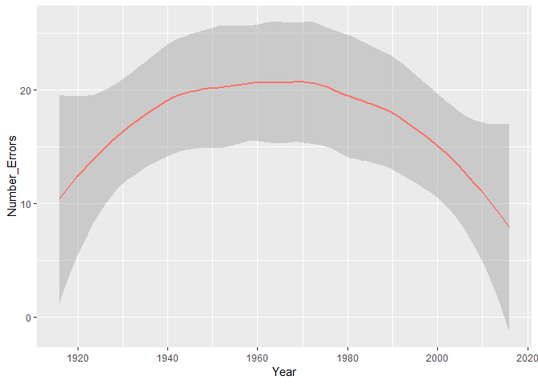

(Saving the plot as pdf/png)

``` r
pdf(paste(MyPath,"/Number_Errors_Over_Time_Markov.pdf", sep=""), width = 10, height = 7)
    par(mfrow=c(1,1))
    par(mar=c(5,5,5,5))
    ggplot(data=Errors_matrix, aes(Year)) +
      geom_smooth(aes(y=Number_Errors, color = "red") ,show.legend = FALSE)
```

    ## `geom_smooth()` using method = 'loess' and formula 'y ~ x'

``` r
png(paste(MyPath,"/Number_Errors_Over_Time_Markov.png", sep=""), width = 800, height = 500)
    par(mfrow=c(1,1))
    par(mar=c(5,5,5,5))
    ggplot(data=Errors_matrix, aes(Year)) +
      geom_smooth(aes(y=Number_Errors, color = "red") ,show.legend = FALSE)
```

    ## `geom_smooth()` using method = 'loess' and formula 'y ~ x'

Defining my data.frame of number of errors per state
----------------------------------------------------

``` r
errors_states<-as.data.frame(errors_states)  
colnames(errors_states) <- c("State")
```

Plot Number of Errors per State (1 - Flipped w/ legend)
-------------------------------------------------------

``` r
ggplot(errors_states) +
  stat_count(mapping = aes(x = State, fill = State)) +
  coord_flip() +
  theme(legend.position = "top")
```

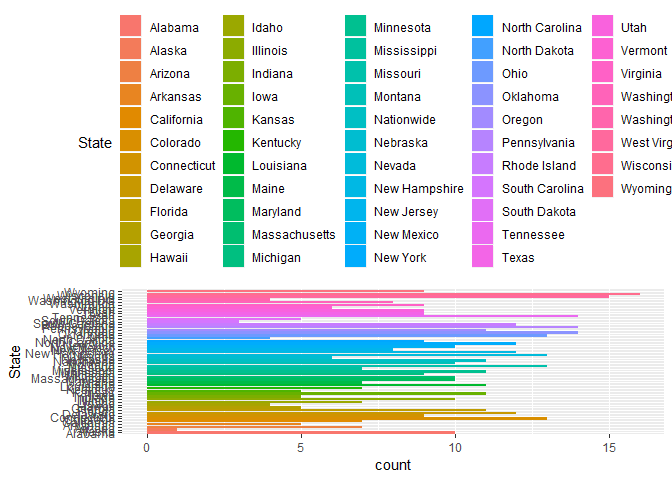

(Saving the plot as pdf/png)

``` r
pdf(paste(MyPath,"/Markov_Errors_per_State_1.pdf", sep=""), width=10, height=7)
    par(mfrow=c(1,1))
    par(mar=c(5,5,5,5))
    ggplot(errors_states) +
      stat_count(mapping = aes(x = State, fill = State)) +
      coord_flip() +
      theme(legend.position = "top")
    dev.off()
```

    ## png 
    ##   2

``` r
png(paste(MyPath,"/Markov_Errors_per_State_1.png", sep=""), width=800, height=500)
    par(mfrow=c(1,1))
    par(mar=c(5,5,5,5))
    ggplot(errors_states) +
      stat_count(mapping = aes(x = State, fill = State)) +
      coord_flip() +
      theme(legend.position = "top")
    dev.off()
```

    ## png 
    ##   2

Plot Number of Errors per State (2 - Flipped without legend)
------------------------------------------------------------

``` r
ggplot(errors_states) +
  stat_count(mapping = aes(x = State, fill = State)) +
  coord_flip()
```

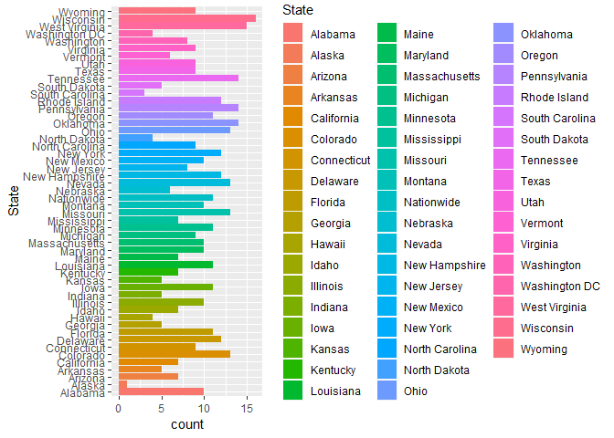

(Saving the plot as pdf/png)

``` r
pdf(paste(MyPath,"/Markov_Errors_per_State_2.pdf", sep=""), width=10, height=7)
    par(mfrow=c(1,1))
    par(mar=c(5,5,5,5))
    ggplot(errors_states) +
      stat_count(mapping = aes(x = State, fill = State)) +
      coord_flip()
    dev.off()
```

    ## png 
    ##   2

``` r
png(paste(MyPath,"/Markov_Errors_per_State_2.png", sep=""), width=800, height=500)
    par(mfrow=c(1,1))
    par(mar=c(5,5,5,5))
    ggplot(errors_states) +
      stat_count(mapping = aes(x = State, fill = State)) +
      coord_flip()
    dev.off()
```

    ## png 
    ##   2

Plot Number of Errors per State (3 - Flipped with legend)
=========================================================

``` r
ggplot(errors_states) +
  stat_count(mapping = aes(x = State, fill = State)) +
  theme(legend.position = "top")
```

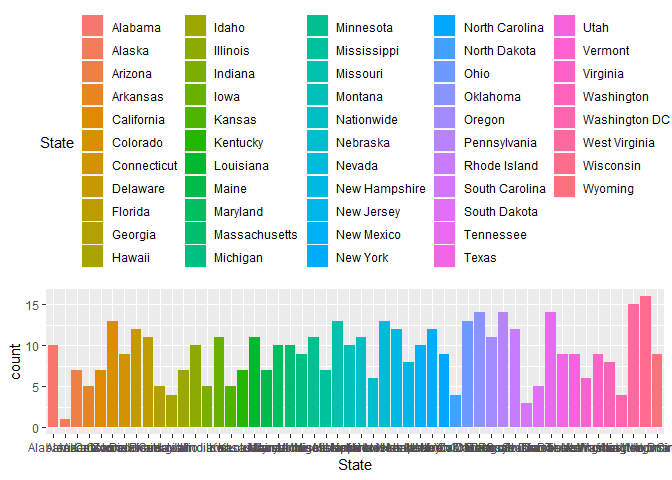

(Saving the plot as pdf/png)

``` r
pdf(paste(MyPath,"/Markov_Errors_per_State_3.pdf", sep=""), width=7, height=10)
    par(mfrow=c(1,1))
    par(mar=c(5,5,5,5))
    ggplot(errors_states) +
      stat_count(mapping = aes(x = State, fill = State)) +
      theme(legend.position = "top")
    dev.off()
```

    ## png 
    ##   2

``` r
png(paste(MyPath,"/Markov_Errors_per_State_3.png", sep=""), width=500, height=800)
    par(mfrow=c(1,1))
    par(mar=c(5,5,5,5))
    ggplot(errors_states) +
      stat_count(mapping = aes(x = State, fill = State)) +
      theme(legend.position = "top")
    dev.off()
```

    ## png 
    ##   2

Plot Number of Errors per State (4 - Flipped without legend)
============================================================

``` r
ggplot(errors_states) +
  stat_count(mapping = aes(x = State, fill = State))
```

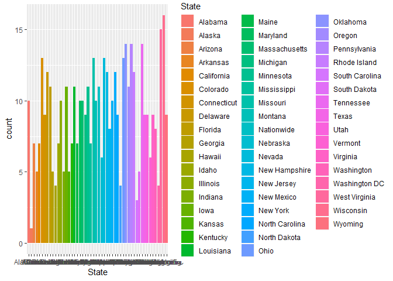

(Saving the plot as pdf/png)

``` r
pdf(paste(MyPath,"/Markov_Errors_per_State_4.pdf", sep=""), width=7, height=10)
    par(mfrow=c(1,1))
    par(mar=c(5,5,5,5))
    ggplot(errors_states) +
      stat_count(mapping = aes(x = State, fill = State))
    dev.off()
```

    ## png 
    ##   2

``` r
png(paste(MyPath,"/Markov_Errors_per_State_4.png", sep=""), width=500, height=800)
    par(mfrow=c(1,1))
    par(mar=c(5,5,5,5))
    ggplot(errors_states) +
      stat_count(mapping = aes(x = State, fill = State))
    dev.off()
```

    ## png 
    ##   2

2020 Presidential Election Prediction
-------------------------------------

Some data wrangling in my "Predictions\_2020" variable from my Markov model

``` r
Predictions_2020 <- apply(Predictions_2020,2,tolower)
Predictions_2020 <-as.data.frame(Predictions_2020, stringsAsFactors = TRUE)
colnames(Predictions_2020) <-c("State", "Pred_winner")
Predictions_2020_by_party <- split(Predictions_2020, Predictions_2020$Pred_winner)
```

Defining variables for which states are predicted as democratic or republican

``` r
all_states <- map_data("state") 
states_democratic  <-as.vector(Predictions_2020_by_party$dem[,1])
states_republican  <- as.vector(Predictions_2020_by_party$rep[,1])
```

### Creating a US map with the 2020 Presidential Election using Markov Chain

``` r
ggplot(all_states, aes(x=long, y=lat, group = group)) +
  geom_polygon(fill="grey", colour = "white") +
  geom_polygon(fill="blue", data = filter(all_states, region %in% states_democratic), color = "white") +
  geom_polygon(fill="red", data = filter(all_states, region %in% states_republican), color = "white") +
  labs(title = "2020 Presidential Election using Markov Chain")
```


(Saving the plot as pdf/png)

``` r
pdf(paste(MyPath,"/2020_Presidential_Election_Prediction.pdf", sep=""), width=10, height=7)
    par(mfrow=c(1,1))
    par(mar=c(5,5,5,5))
    ggplot(all_states, aes(x=long, y=lat, group = group)) +
      geom_polygon(fill="grey", colour = "white") +
      geom_polygon(fill="blue", data = filter(all_states, region %in% states_democratic), color = "white") +
      geom_polygon(fill="red", data = filter(all_states, region %in% states_republican), color = "white") +
      labs(title = "2020 Presidential Election using Markov Chain")
      
png(paste(MyPath,"/2020_Presidential_Election_Prediction.png", sep=""), width=800, height=500)
    par(mfrow=c(1,1))
    par(mar=c(5,5,5,5))
    ggplot(all_states, aes(x=long, y=lat, group = group)) +
      geom_polygon(fill="grey", colour = "white") +
      geom_polygon(fill="blue", data = filter(all_states, region %in% states_democratic), color = "white") +
      geom_polygon(fill="red", data = filter(all_states, region %in% states_republican), color = "white") +
      labs(title = "2020 Presidential Election using Markov Chain")
```

Add a new chunk by clicking the *Insert Chunk* button on the toolbar or by pressing *Ctrl+Alt+I*.

When you save the notebook, an HTML file containing the code and output will be saved alongside it (click the *Preview* button or press *Ctrl+Shift+K* to preview the HTML file).

The preview shows you a rendered HTML copy of the contents of the editor. Consequently, unlike *Knit*, *Preview* does not run any R code chunks. Instead, the output of the chunk when it was last run in the editor is displayed.
